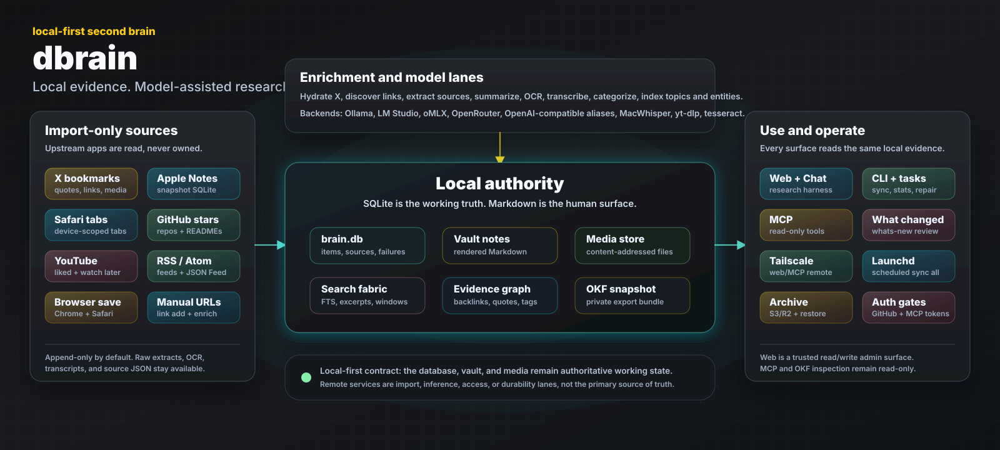

# dbrain



`dbrain` is a local-first second-brain scaffold for incremental imports from X
bookmarks, Apple Notes, GitHub stars, YouTube, Safari tabs and manually
submitted web links, with Markdown note rendering for Obsidian, Open Knowledge
Format export, and local query over the imported corpus.

## Documentation Map

- [README.md](README.md): install, quick orientation, safety model, and
  configuration notes.
- [COMMANDS.md](COMMANDS.md): full command index and detailed command/task
  reference.
- [TAILSCALE.md](TAILSCALE.md): remote web/MCP access, built-in `tsnet`,
  Tailscale Funnel, tailnet policy, DNS, and public-auth operations.
- [MCP.md](MCP.md): MCP tools, research semantics, transports, client config,
  and evals.
- [browser/chrome-extension/README.md](browser/chrome-extension/README.md) and
  [browser/safari-extension/README.md](browser/safari-extension/README.md):
  browser extensions for saving the active tab URL to dbrain.
- [docs/architecture.md](docs/architecture.md): package and data-flow architecture.
- [Agent Skills](#agent-skills): installable corpus skills, repo-local release
  audit/review workflows, and model bakeoff guidance.
- [docs/schema-migrations.md](docs/schema-migrations.md): SQLite schema and
  migration guidance.
- [docs/web-route-capabilities.md](docs/web-route-capabilities.md): web route
  capability and trust-boundary map.

## Install

Install the latest released `dbrain` CLI with Homebrew:

```sh
brew install darron/tap/dbrain
```

Or tap once and install by formula name:

```sh
brew tap darron/tap
brew trust --formula darron/tap/dbrain
brew install dbrain
```

Before running first-time setup, install the recommended local runtime. This
gives new installs source extraction, local summaries/categorization, and the
preferred open-source speech-to-text backend:

```sh
brew install summarize ollama whisper-cpp
brew install --cask google-chrome
```

Homebrew's `summarize` formula installs its required `ffmpeg`, `node`,
`tesseract`, and `yt-dlp` dependencies. Ollama enables the installer's default
local model profile. `whisper-cpp` supplies `whisper-cli`, the preferred local
backend for X media and YouTube audio transcription. Chrome supplies the
cookie-backed session used by X and YouTube imports. Install these before
`dbrain install` so the setup wizard can detect and configure them.

Verify the installed binaries:

```sh
dbrain version
dbrain --no-debug semantic status --json
summarize --help
ollama --version
whisper-cli --help
```

The Homebrew macOS arm64 binary includes the native USearch semantic backend
and reports `supported_ready` with backend `usearch`. Other released platforms
remain CGO-free and report native semantic state as explicitly `unsupported`;
ordinary sync and lexical retrieval continue to work there.

Run the first-time setup wizard:

```sh
dbrain install
```

For a non-XDG single-directory install, pass a user-writable base path:

```sh
dbrain install --base-path ~/dbrain --yes
```

The installer creates the config/data/vault/log/cache layout, detects local
helpers such as `summarize`, MacWhisper, Ollama, LM Studio, oMLX, `tesseract`,
`ffprobe`, and `yt-dlp`, asks which import sources `sync all` may contact,
writes those choices into `sync_all.imports`, and separately configures
scheduled sync, Tailscale/tsnet transport, and GitHub web login. Fresh
interactive and `--yes` installs leave every importer disabled until selected.
When `whisper-cli` is present and either pinned speech model is missing,
interactive setup offers to download both checksum-verified models with the
answer defaulted to yes; `--yes` accepts that default automatically. Whisper
downloads show byte progress, and Ollama model pulls/creation stream their
native progress instead of leaving the terminal silent.
On macOS, prompted third-party secrets are written as Keychain-backed
`keychain://dbrain/...` config refs. If Keychain is disabled or unavailable,
the generated web auth session key is written into the `0600` config with a
warning; prompted third-party secrets are skipped rather than written directly
to YAML. If a known `dbrain` Keychain secret already exists, install reuses the
existing `keychain://dbrain/...` reference when you leave the prompt blank.

When the installer detects the Ollama CLI, plain `dbrain install` uses the
local dbrain Ollama profile by default: it writes the embedded Modelfile, pulls
the public base model if needed, creates `dbrain:2026042701`, and writes
`ollama/dbrain:2026042701` to `summary.model` and `categorize.model`. If Ollama
is not available, served local model endpoints are fallback defaults, with LM
Studio used only after Ollama/oMLX options. If no local OCR model/tool is
selected and no OpenRouter key is configured, generated installs skip X photo
OCR so a first `dbrain sync all` does not fail on the hosted OCR default.

For explicit local model setup, the installer has curated model profiles. The
`dbrain` profile writes the local Ollama dbrain wrapper tag to `summary.model`
and `categorize.model`, writes the embedded dbrain Modelfile into the config
directory, pulls the public base model if needed, and creates the local wrapper
tag. The tested oMLX equivalent uses Qwen3.6 35B A3B MLX 4-bit, and the
smaller Ollama profile pulls Gemma 4 12B MLX for machines where memory is the
constraint:

```sh
dbrain install --yes --local-model-profile dbrain

dbrain install --yes --local-model-profile dbrain-omlx

dbrain install --yes --local-model-profile small-ollama
```

The Ollama profiles call the local `ollama` CLI. They do not push or depend on
a redistributed dbrain wrapper tag. To bypass the profile or use a custom tag,
pass the provider-qualified model directly:

```sh
dbrain install --yes --summary-model ollama/dbrain:2026042701 --categorize-model ollama/dbrain:2026042701
```

If you use global `--config-file <path>` with `dbrain install`, the config and
categories files are created next to that file while data, logs, cache, temp
files, and vault content keep the normal XDG data layout. Use `--base-path`
when you want the whole install colocated under one directory.

## Requirements

The end-user Homebrew requirements are installed before `dbrain install` in the
quickstart above. For development in this checkout, install the Go toolchain,
task runner, linter, and inspection tools separately:

```sh
brew install go go-task/tap/go-task golangci-lint sqlite yt-dlp ffmpeg node deno ollama tesseract whisper-cpp
brew install --cask google-chrome
```

Runtime tools and services:

- **Chrome or Chromium**: recommended for cookie-backed X and YouTube imports.
- **`summarize`**: required for source extraction and summary-backed answer synthesis. Verify with `summarize --help`.
- **`whisper-cli`**: the completely open-source whisper.cpp CLI and preferred local speech-to-text backend. Homebrew's Apple Silicon bottle uses the native whisper.cpp acceleration stack, including Metal where supported.
- **Whisper models**: whisper.cpp still needs separate GGML model files. When
  `whisper-cli` is detected, interactive install offers dbrain's pinned,
  checksum-verified base and Silero VAD models by default, while `dbrain
  install --yes` downloads missing models automatically. For an explicit
  repair or custom install, use:

  ```sh
  dbrain install --yes --transcriber whisper.cpp --download-whisper-models
  ```

  The installer writes the models under dbrain's cache directory and shows
  transfer progress. It does not install Homebrew packages; if `whisper-cli`
  is missing, run `brew install whisper-cpp` first.
- **`mw`**: optional MacWhisper CLI compatibility backend. Select it with `--transcriber macwhisper` or `DBRAIN_TRANSCRIPTION_BACKEND=macwhisper`.
- **`ffprobe`**: required for X media transcription. It is installed by Homebrew's `ffmpeg` package.
- **`yt-dlp`**: required for `dbrain import youtube`.
- **`deno` or `node`**: recommended for YouTube challenge solving through `yt-dlp`.
- **`uv`**: recommended for `summarize` helper environments and transcriber setup flows.
- **Local model runtime**: optional for source summaries, answer synthesis, OCR,
  and categorization. dbrain supports Ollama, LM Studio, oMLX, and configured
  OpenAI-compatible backend aliases.
- **`tesseract`**: optional local fallback for OCR.
- **`sqlite3`**: optional, but useful for inspecting `brain.db`.
- **`task`**: required for the top-level development tasks.
- **`golangci-lint`**: required for `task lint`.
- **`npm`**: required for `task web-install` and `task web-build`.
- **`caffeinate`**: optional macOS helper used automatically for long-running leaf commands when available.

Optional hosted services:

- **GitHub token**: `GITHUB_TOKEN` for `dbrain import github stars`.
- **OpenRouter**: `DBRAIN_OPENROUTER_API_KEY` or `OPENROUTER_API_KEY` for hosted categorization, OCR, and model calls.
- **S3-compatible storage / Cloudflare R2**: R2/S3 env or config values for media and SQLite archives.

Apple Notes import is local and direct-SQLite. On macOS it may require granting
Full Disk Access to the `dbrain` binary or, more reliably for local builds, to
the terminal or IDE app launching it. Rebuilding `bin/dbrain` may invalidate a
binary-specific permission grant.

For development in this checkout without touching installed state:

```sh
export DBRAIN_ROOT=.
task build
dbrain config paths
dbrain config env
```

## Commands

See [COMMANDS.md](COMMANDS.md) for the full command index and detailed command/task reference.

Common entry points:

- `dbrain serve web`
- `dbrain serve remote`
- `dbrain serve mcp`
- `dbrain install`
- `dbrain sync all`
- `dbrain okf export`
- `dbrain research <question>`
- `dbrain whats-new --since 24h`
- `dbrain search <query>`
- `dbrain get <source-key-or-id>`
- `dbrain config env`
- `dbrain notify status --json`

## Safety And Trust Model

`dbrain` is local-first, but it stores high-signal personal data. Treat
`brain.db`, rendered vault notes, generated OKF bundles, media files, logs,
temp files, chat transcripts, and tsnet state as private local state. Keep
`data/`, `vault/`, `okf/`,
`tmp/`, `cache/`, `logs/`, `.env`, `.envrc`, `.gocache/`, `.gomodcache/`,
`web/ui/node_modules/`, and `bin/` out of git and public release archives unless
you intentionally scrub and include them.

Imports are intended to be import-only against upstream services and apps. X,
GitHub, YouTube, Apple Notes, and Safari tab flows materialize local evidence;
Apple Notes and Safari tabs read from dbrain-owned SQLite snapshots. Normal
imports should not mutate upstream apps or delete local memories just because an
upstream bookmark, tab, note, star, or video later disappears.

`dbrain serve web` and `dbrain serve remote --web` are trusted read/write
administration surfaces. They can edit tags, queue links, save diagnostic chat
transcripts, trigger model-backed research/synthesis, and access archived media
helpers. `serve remote` relies on Tailscale/tsnet identity, ACLs, node tags, and
same-origin checks by default. Optional GitHub OAuth can add a dbrain session
gate for the web UI when `auth.enabled` is configured, but the default remains
the existing no-login local/trusted-network behavior. Do not expose the web UI
  through a public reverse proxy unless you have explicitly reviewed the full
  route surface and auth boundary. `--tsnet-funnel` is public exposure on the
  same tsnet node identity, hostname, state directory, and auth credentials; it
  is not a separate dbrain feature set. Funnel startup fails closed unless
  GitHub OAuth is enabled for a selected web surface and bearer authentication
  is enabled for a selected MCP surface. MCP surfaces are read-only, but they
  still expose local brain content to connected clients.
Optional DB-backed MCP bearer auth can protect Streamable HTTP MCP endpoints
when `mcp.auth.enabled` is set; startup logs warn loudly when HTTP or tsnet MCP
is served without that guard.

Model-backed commands can send local evidence to the configured model provider.
Local Ollama, LM Studio, oMLX, and configured OpenAI-compatible backend aliases
stay on their configured endpoints. Hosted OpenRouter or OpenAI-compatible
calls may receive source extracts, note text, item text, transcripts, OCR text,
tags, and images depending on the command. Web, CLI, and MCP research use
model-assisted query planning by default when a planner or summary model is
configured; use `--no-planner`, `disable_planner=true`, or retrieval-only modes
when you want deterministic local retrieval without planner model calls.

Archive features use S3-compatible storage only when configured. Media archives
and SQLite snapshots can contain personal content. A public media base URL makes
archived media links anonymously readable wherever that bucket policy allows;
without a public base URL, the web UI can still proxy or sign archive access for
trusted web users.

Local maintenance commands can delete, replace, or reset local dbrain state:
`dbrain archive media --prune-local` can remove local media files after archived
coverage is complete, `dbrain sqlite restore` replaces the active SQLite DB
after moving existing DB files aside, `dbrain tsnet reset` removes durable
Tailscale node state, `dbrain import apple-notes --forget-excluded` purges
indexed local content for notes that are now excluded, and `dbrain import
youtube` prunes deprecated `youtube_history` rows and orphaned legacy YouTube
sources as part of its import cleanup. `dbrain repair sources` clears selected
derived extraction/summary state so it can be rebuilt. Prefer `--dry-run` on
commands that offer it.

See [docs/architecture.md](docs/architecture.md) for the current package/state
architecture and [docs/web-route-capabilities.md](docs/web-route-capabilities.md)
for the web route capability matrix. See
[docs/schema-migrations.md](docs/schema-migrations.md) for SQLite migration,
backup, restore, and downgrade policy. See
[docs/maintenance-operations.md](docs/maintenance-operations.md) for local
delete, purge, prune, restore, and reset paths.

## Dev Tasks

- `task build`
- `task fmt`
- `task lint`
- `task test-ci`
- `task test` for local ambient-env debugging
- `task test-mcp`
- `task web-build`
- `task web-install`

## Configuration And Layout

Installed/default layout:

- `~/.config/dbrain/config.yaml`: optional configuration file
- `~/.config/dbrain/categories.yaml`: tag rewrite/category vocabulary
- `~/.local/share/dbrain/brain.db`: local SQLite state
- `~/.local/share/dbrain/vault/items/...`: rendered Markdown notes for Obsidian
- `~/.local/share/dbrain/vault/sources/...`: rendered Markdown notes for linked sources
- `~/.local/share/dbrain/vault/entities/...`: derived entity notes and entity index
- `~/.local/share/dbrain/vault/topics/...`: generated topic/MOC notes
- `~/.local/share/dbrain/okf/current/...`: generated private OKF bundle
- `~/.local/share/dbrain/tmp`: temporary working files
- `~/.local/share/dbrain/cache`: cache files
- `~/.local/share/dbrain/logs`: log files

`dbrain` honors `XDG_CONFIG_HOME` and `XDG_DATA_HOME`; if set, the same
`dbrain` subdirectories are created under those bases.

To pin a command or service to one installed config file without inheriting a
checkout's `DBRAIN_ROOT`, pass `--config-file <path>` or set
`DBRAIN_CONFIG_FILE=<path>`. The config directory is the file's parent
directory; data, logs, cache, temp files, and the vault still default to the XDG
data layout unless separately configured by a feature-specific setting.

For local development or isolated runs, pass `--root <dir>` or set
`DBRAIN_ROOT=<dir>`. Explicit roots keep the original self-contained layout:

- `<dir>/config.yaml`
- `<dir>/categories.yaml`
- `<dir>/data/brain.db`
- `<dir>/vault/...`
- `<dir>/okf/current/...`
- `<dir>/tmp`, `<dir>/cache`, and `<dir>/logs`

For repo-local development, this keeps commands pointed at the checkout:

```sh
export DBRAIN_ROOT=.
```

Resolution order for config layout is `--config-file`, `--root`,
`DBRAIN_CONFIG_FILE`, `DBRAIN_ROOT`, then XDG defaults.

### Scheduled hard-failure notifications

`serve remote` can report typed hard failures from its scheduled `sync all`
process through built-in notification providers. Automatic delivery is disabled
by default. Configure and test the provider while the global switch remains off,
then activate the installed service as a separate operator step:

```yaml
notifications:
  enabled: false
  repeat_after: "6h"
  buzz:
    enabled: true
    relay_url: "wss://buzz.example"
    channel_id: "00000000-0000-4000-8000-000000000001"
    private_key_ref: "keychain://dbrain/notifications-buzz"
    allow_private_origin: false
  slack:
    enabled: true
    webhook_url_ref: "keychain://dbrain/notifications-slack-webhook"
```

1. Create a dedicated, least-privilege Nostr identity for the dbrain service.
2. Admit its public key to the Buzz relay and target channel as that deployment
   requires.
3. Store the private key in Keychain, 1Password, or an environment variable
   visible to the launchd service. `private_key_ref` must be an `env:`, `op://`,
   or `keychain://` reference; never put the private key itself in YAML. The
   resolved value must be a 64-character hexadecimal secret or an `nsec`.
4. Configure an origin-only `wss://` relay URL, the Buzz channel UUID, and the
   typed secret reference. Keep `allow_private_origin: false` unless this exact
   relay is intentionally on localhost, a private IP, or CGNAT.
5. Configure Slack with `webhook_url_ref`, never an inline webhook URL. It
   accepts the same typed secret-reference forms: `env:DBRAIN_SLACK_WEBHOOK`,
   `op://Private/dbrain-notifications-slack/webhook-url`, or
   `keychain://dbrain/notifications-slack-webhook`. The resolved webhook must
   use Slack's official incoming-webhook host, `hooks.slack.com` or
   `hooks.slack-gov.com`, over HTTPS; other hosts and private origins are not
   accepted.
6. With `notifications.enabled: false` and the provider being tested enabled,
   run its explicit test against the intended production config:

   ```sh
   dbrain --config-file ~/.config/dbrain/config.yaml notify test buzz
   dbrain --config-file ~/.config/dbrain/config.yaml notify test slack
   ```

   Each command sends a clearly labeled synthetic message without changing the
   incident/outbox state. Buzz success means its relay returned `OK`; Slack
   success means Slack accepted the webhook HTTP request. Neither result is a
   user delivery, message, acknowledgement, or read-receipt claim. Slack has
   no remote message ID here: its reported correlation ID is dbrain's local
   notification ID.
7. After the provider test succeeds, set `notifications.enabled: true` and
   restart the installed launchd service separately:

   ```sh
   dbrain --config-file ~/.config/dbrain/config.yaml launchd restart
   ```

8. Inspect the same explicit production boundary after restart:

   ```sh
   dbrain --config-file ~/.config/dbrain/config.yaml notify status --json
   ```

Buzz uses NIP-42 authentication and signs a NIP-29 kind-9 channel event with an
`h=<channel UUID>` tag. Buzz requires that channel identifier to be a UUID even
though generic NIP-29 group identifiers need not be UUIDs; see Buzz's
[NOSTR guide](https://github.com/block/buzz/blob/main/NOSTR.md) for its current
kind/tag and membership contract. Kind-9 channel content is not end-to-end
encrypted. Use a channel whose membership and relay retention policy are
appropriate for operational incident text.

The first failure for each scheduled operation and typed error notifies
immediately. `notifications.repeat_after` is one positive Go duration, `6h` by
default, applied independently to each error type: identical recurrences are
counted but suppressed until that type's boundary, while a different type can
notify immediately. At the boundary, one reminder includes the accumulated
count and begins a new suppression window. A fully successful scheduled sync
closes open incidents and can send one consolidated recovery. If the same type
fails again inside its prior window, it reopens silently; rapid fail/recover
flaps therefore cannot bypass suppression or produce a recovery for every
success.

Only hard failures settled by the still-running `serve remote` scheduled-sync
process enter this state machine. Manual `sync all`, overlap/lock skips,
graceful cancellation, and tolerated per-item errors do not notify. Provider
delivery state is recorded durably before the attempt; retry behavior then
follows the typed provider/error policy: temporary failures remain pending for
retry, permanent failures do not, and ambiguous transport outcomes are retained
without claiming that Slack did or did not post a message. A provider failure
does not stop the other enabled provider: with Buzz and Slack both enabled,
each future incident fans out to both. A delivery failure does not change the
sync result or prevent the post-sync audit. Redacted incident and per-provider
outbox state lives under `<log_dir>/notifications/state.json`.

This is not a process watchdog. Independent detection of process death,
pre-readiness startup failure, or a stalled scheduler is deferred, as are the
human acknowledgement/read receipts. Editing a checkout or sample config also
does not activate an installed process; release, installation, production
configuration, setting `notifications.enabled: true`, and service restart
remain explicit operator steps.

To inspect the resolved installation without repairing or mutating it, run:

```sh
dbrain audit all --profile standard --json
dbrain audit all --profile deep --json
dbrain audit github-stars --json
dbrain audit apple-notes --json
```

The stable `dbrain.audit.v1` report covers target/build identity, SQLite
integrity, scheduler continuity, importer polling/arrivals, pipeline
partitions/provenance, media durability, SQLite backup age, and OKF health.
The command uses a query-only SQLite snapshot and bounded metrics/remote
metadata reads. Exit codes are 0 pass, 1 warn, 2 fail, and 3 unknown or
bootstrap/configuration failure. See [COMMANDS.md](COMMANDS.md#dbrain-audit)
for profiles, category scopes, privacy rules, and flags.

Local stdio agents, and remote agents using bearer-authenticated HTTP/tsnet,
can read the same bounded report through MCP `dbrain_audit`. Its default `fast`
profile runs the complete local fast registry
under a fixed ten-second deadline and process-wide singleflight; `standard`
only reads the newest persisted exact-profile standard report. MCP cannot run
deep checks or supply categories, time windows, paths, URLs, identifiers,
archive keys, endpoints, or download limits.

When web authentication is enabled, `dbrain serve web` and
`dbrain serve remote --web` also expose the shared audit report through the
session-authenticated administration API:

```text
GET  /api/audit/latest?profile=standard
GET  /api/audit/history?profile=standard&limit=20
POST /api/audit/run                     {"profile":"fast|standard"}
GET  /api/audit/runs/{audit_id}
```

Page loads and GET requests never start an audit. The POST body is strict JSON
and limited to 4 KiB; deep and category/path/URL/archive controls are not
available. One process-wide on-demand run may be active, duplicate requests for
its profile reuse the same opaque process-run handle, and standard starts are
limited to one per minute. A completed status contains the immutable report,
whose nested `report.audit_id` is distinct from the outer process-run
`audit_id`. These routes are deliberately unavailable when `auth.enabled` is
false and cannot be authorized by the doctor endpoint's service-auth header.

The authenticated **System** page presents the current exact-profile standard
report as the sole whole-system health authority. It keeps a fast local refresh
separate, renders poll cadence separately from arrivals, preserves current,
pending, blocked, terminal, failed, and unknown pipeline outcomes, and uses the
exact media, SQLite archive, and OKF audit checks for durability. Stale or
absent standard reports remain visibly unknown; a newer fast pass cannot make
them current. The legacy `backlog.drained` signal remains available as
**Source backlog drained** and is explicitly scoped to X hydration, link
discovery, source extraction, and source summary—not whole-system health.

The explicit CLI-only `deep` profile additionally downloads the newest SQLite
archive into a private temporary directory, decompresses and validates that
candidate without replacing the active database, and reconciles the complete
configured `media/` archive inventory against local records. The archive,
database, and aggregate temporary-byte defaults are 20 GiB, 100 GiB, and
120 GiB. Configuration and environment values may only lower those defaults;
an operator must pass `--max-archive-bytes`, `--max-database-bytes`, or
`--max-temp-bytes` explicitly to raise them for one deep run. Deep audit
temporary files are removed on success, failure, timeout, or cancellation.

Deep imports also perform bounded, complete upstream parity for the configured
Apple Notes, Safari Tabs, X Bookmarks, GitHub Stars, YouTube Liked, YouTube
Watch Later, and feed sources. Each inventory is read-only, runs sequentially
under its own five-minute ceiling, and is capped at 100,000 unique identities
and 10,000 pages. The portable report contains counts and status only—not
identities, note text, titles, URLs, response bodies, paths, cookies, or tokens.
A missing credential, inaccessible snapshot, ambiguous cursor/device, parser
failure, or unproven traversal end is `unknown`; a complete inventory with
missing local identities is `fail`.

The source-specific commands are `audit apple-notes`, `safari-tabs`,
`x-bookmarks`, `github-stars`, `youtube-liked`, `youtube-watch-later`, and
`feeds`. They default to deep, reject fast/standard, and force only the named
parity check even when scheduled import for that source is disabled. The
source's poll check remains truthfully skipped as `feature_disabled`. These
commands never delete, import, repair, retry, restore, prune, or archive data;
Apple Notes and Safari use interruptible dbrain-owned SQLite snapshots, and
remote clients are confined to their fixed or configured safe origins. Deep
parity is CLI-only: scheduled audits, MCP, and the admin API remain fast or
standard and receive no upstream inventory authority.

Audit timeout overrides live under `audit.timeouts` (or the matching
`DBRAIN_AUDIT_TIMEOUT_*` variables). They can only lower the built-in ceilings:
`bootstrap` 10s, `local_query` 5s fast/30s standard,
`metrics_or_manifest` 10s, `sqlite_or_okf_integrity` 2m,
`remote_metadata` 2m per check, and `remote_request` 30s per request/page.
Invalid or non-positive durations fail bootstrap; larger values are clamped.

Configuration currently resolves in this order: shell environment, `.envrc` or
`.env` in the config/root directory, then `config.yaml`. The YAML file can use
exact environment-style keys under `env`, or cleaner grouped keys:

Production audit bootstrap snapshots the supported dotenv files and YAML once
with no-follow regular-file and byte-limit checks, then reuses those frozen
values for feature resolution without executing shell syntax or resolving
secret references.

```yaml
summary:
  model: ollama/qwen3.6:35b-a3b
  language: English

lmstudio:
  base_url: http://127.0.0.1:1234/v1

omlx:
  base_url: http://127.0.0.1:8000/v1

openrouter:
  api_key: op://Private/dbrain/OPENROUTER_API_KEY
  base_url: https://openrouter.ai/api/v1

ollama:
  base_url: http://127.0.0.1:11434

http:
  user_agent: ""

source:
  reader:
    base_url: https://r.jina.ai/
    domains: canada.ca,open.canada.ca,fintrac-canafe.canada.ca
  wayback:
    enabled: true
    availability_url: https://archive.org/wayback/available?url={escaped_url}

archive:
  provider: r2
  bucket: dbrain-media
  upload: true

env:
  GITHUB_TOKEN: keychain://dbrain/github-token
```

Secret-bearing fields can be direct values or typed references. Supported
references are `env:NAME`, `op://vault/item/field`, and
`keychain://service/account`. References are resolved by `dbrain` only when a
command needs that secret, so they do not need to be exported into your whole
shell session.

For macOS Keychain, store a secret with:

```sh
security add-generic-password -U -s dbrain -a openrouter-api-key -w "..."
```

Then reference it from `config.yaml`:

```yaml
openrouter:
  api_key: keychain://dbrain/openrouter-api-key
```

[config.yaml.sample](config.yaml.sample) contains every currently supported grouped config value
with its matching environment variable comment on the same line:

```sh
cp config.yaml.sample ~/.config/dbrain/config.yaml
```

## Preflight Checks

`dbrain` runs lightweight preflight checks after resolving the active
configuration. The checks are meant to catch missing local vocabulary files and
missing secrets before a long import or enrichment run does partial work.

Missing `categories.yaml` is a warning, not a hard failure. Categorization can
still run, but it will not apply the canonical vocabulary rewrites and drops
from the category file. Homebrew/default installs should keep the file at:

```sh
~/.config/dbrain/categories.yaml
```

Development roots should keep it beside the root config:

```sh
<root>/categories.yaml
```

These selected features fail early when their required secrets are missing:

- GitHub imports require `GITHUB_TOKEN` or `github.token`.
- OpenRouter-backed categorization requires `DBRAIN_OPENROUTER_API_KEY`,
  `OPENROUTER_API_KEY`, or `openrouter.api_key`.
- OpenRouter-backed OCR requires the same OpenRouter key when the OCR model is
  an `openrouter/...` model.
- R2/S3 archive paths require an access key and secret when archive upload,
  bucket, endpoint, or public archive URL settings are configured.

Use `--config-file ~/.config/dbrain/config.yaml` for Homebrew/background
service runs when you want the installed binary to ignore checkout-local
environment overrides.

Every command help screen includes the effective configuration lookup summary.
Use this command for the authoritative env/config mapping:

```sh
dbrain config env
```

Use `dbrain config env --markdown` when you want a Markdown table for
docs or issue comments.

## Environment Variables

Lookup order is shell environment, `.envrc` or `.env` in the active config/root
directory, then `config.yaml`. `--root` wins over `DBRAIN_ROOT`.

Secret config values for GitHub import/OAuth, OpenRouter/OpenAI/Ollama,
LM Studio, or oMLX API keys, auth session signing, and R2/S3 credentials may be
direct values or typed references: `env:NAME`,
`op://vault/item/field`, or `keychain://service/account`.

| Environment variable(s) | config.yaml key | Default | Purpose |
| --- | --- | --- | --- |
| `DBRAIN_ROOT` | `(env only)` | `` | CLI root override. `--root` wins when both are set. |
| `DBRAIN_CONFIG_FILE` | `(env only)` | `` | CLI config file override. `--config-file` wins when both are set. |
| `XDG_CONFIG_HOME` | `(env only)` | `~/.config` | Base directory for default config files. |
| `XDG_DATA_HOME` | `(env only)` | `~/.local/share` | Base directory for default database, vault, cache, tmp, and logs. |
| `GITHUB_TOKEN` | `github.token` or `env.GITHUB_TOKEN` | `` | GitHub API token for importing stars. |
| `DBRAIN_AUTH_ENABLED` | `auth.enabled` | `false` | Enable session-gated web UI login. Disabled by default. |
| `DBRAIN_AUTH_PROVIDERS` | `auth.providers` | `github when auth is enabled` | OAuth providers allowed for web login; currently only `github` is supported. |
| `DBRAIN_AUTH_BASE_URL` | `auth.base_url` | `http://127.0.0.1:8742` | Public origin used for OAuth callback URLs. Must be `https://` when auth is enabled for non-localhost deployments. |
| `DBRAIN_AUTH_SESSION_KEY` | `auth.session_key` | `` | Secret key used to sign OAuth state; must be at least 32 random characters. Generate with `openssl rand -hex 32`. |
| `DBRAIN_AUTH_GITHUB_CLIENT_ID` | `auth.github.client_id` | `` | GitHub OAuth app client ID for web UI login. |
| `DBRAIN_AUTH_GITHUB_CLIENT_SECRET` | `auth.github.client_secret` | `` | GitHub OAuth app client secret for web UI login. |
| `DBRAIN_MCP_AUTH_ENABLED` | `mcp.auth.enabled` | `false` | Require DB-backed Bearer tokens on MCP Streamable HTTP endpoints. Create tokens with `dbrain auth mcp token add NAME`. |
| `DBRAIN_SUMMARY_MODEL` / `SUMMARIZE_MODEL` | `summary.model` | `` | Default model for summarize-backed source and answer synthesis. |
| `DBRAIN_SUMMARY_LANGUAGE` / `DBRAIN_OUTPUT_LANGUAGE` / `SUMMARIZE_LANGUAGE` | `summary.language` | `en` | Output language for summaries; use `auto` to match source language. |
| `DBRAIN_CATEGORIZE_MODEL` | `categorize.model` | `openrouter/google/gemini-2.5-flash` | Default LLM model for item/source categorization. |
| `DBRAIN_OCR_MODEL` / `DBRAIN_X_PHOTO_OCR_MODEL` | `ocr.model` | `openrouter/google/gemini-3.1-flash-lite-preview` | Default model for X photo OCR. |
| `DBRAIN_RESEARCH_SEMANTIC_MODE` | `research.semantic.mode` | `off` | Semantic retrieval mode: `off`, lexical-identical `shadow`, or RRF-fused `on`. |
| `DBRAIN_RESEARCH_SEMANTIC_PROVIDER` | `research.semantic.provider` | `ollama` | Embedding provider; the foundation supports local Ollama only. |
| `DBRAIN_RESEARCH_SEMANTIC_MODEL` | `research.semantic.model` | `` | Exact Ollama embedding model; required for effective `shadow` or `on`. |
| `DBRAIN_RESEARCH_SEMANTIC_DIMENSIONS` | `research.semantic.dimensions` | `0` | Positive embedding width; required for effective `shadow` or `on`. |
| `DBRAIN_RESEARCH_SEMANTIC_INDEX_BACKEND` | `research.semantic.index_backend` | `exact` | Exact final scoring with automatic native USearch candidate admission when an active root is available; SQLite exact scan remains the bounded fallback. |
| `DBRAIN_RESEARCH_SEMANTIC_CANDIDATE_DEPTH` | `research.semantic.candidate_depth` | `50` | Semantic candidates retained for fusion. |
| `DBRAIN_RESEARCH_SEMANTIC_EXACT_FALLBACK_MAX_CHUNKS` | `research.semantic.exact_fallback_max_chunks` | `25000` | Requested exact-vector limit. Configuration may lower the measured 25,000-vector safety ceiling but cannot raise it; larger current profiles report `needs_index` and remain lexical. |
| `DBRAIN_OLLAMA_BASE_URL` / `OLLAMA_BASE_URL` / `OLLAMA_HOST` | `ollama.base_url` | `http://127.0.0.1:11434` | Ollama endpoint for local model calls. |
| `DBRAIN_OLLAMA_API_KEY` / `OLLAMA_API_KEY` | `ollama.api_key` | `ollama` | API key label used for Ollama-compatible local calls. |
| `DBRAIN_LMSTUDIO_BASE_URL` | `lmstudio.base_url` | `http://127.0.0.1:1234/v1` | LM Studio OpenAI-compatible endpoint for local model calls. |
| `DBRAIN_LMSTUDIO_API_KEY` | `lmstudio.api_key` | `lm-studio` | API key label used for LM Studio local calls. |
| `DBRAIN_OMLX_BASE_URL` | `omlx.base_url` | `http://127.0.0.1:8000/v1` | oMLX OpenAI-compatible endpoint for local model calls, including images when the selected oMLX model supports them. |
| `DBRAIN_OMLX_API_KEY` | `omlx.api_key` | `` | API key for oMLX local calls when oMLX auth is enabled; omitted when empty. |
| `(config only)` | `llm_backends.<alias>.transport` | `openai_chat_completions` | Configured OpenAI-compatible backend alias transport. |
| `(config only)` | `llm_backends.<alias>.base_url` | `` | Configured OpenAI-compatible backend endpoint, for example `http://127.0.0.1:8080/v1`. |
| `(config only)` | `llm_backends.<alias>.api_key` | `` | Optional API key or secret ref for a configured backend alias. |
| `(config only)` | `llm_backends.<alias>.local` | `false` | Marks a configured backend alias as local for provenance and bakeoff reporting. |
| `OPENAI_BASE_URL` | `openai.base_url` or `env.OPENAI_BASE_URL` | `` | OpenAI-compatible base URL used by the summarize adapter when already exported. |
| `OPENAI_API_KEY` | `openai.api_key` or `env.OPENAI_API_KEY` | `` | OpenAI-compatible API key used by the summarize adapter when already exported. |
| `OPENAI_USE_CHAT_COMPLETIONS` | `openai.use_chat_completions` or `env.OPENAI_USE_CHAT_COMPLETIONS` | `` | Forces summarize/OpenAI-compatible calls onto chat completions when set. |
| `DBRAIN_USER_AGENT` | `http.user_agent` | `dbrain/<short-sha>` | User-Agent header for outbound API calls; source/web fetching keeps its own fetch headers. |
| `DBRAIN_METRICS_ENABLED` | `metrics.enabled` | `false` | Enable append-only local JSONL metrics for `sync all`, scheduled sync, and scheduled SQLite archives. |
| `DBRAIN_METRICS_PATH` | `metrics.path` | `<log_dir>/metrics.jsonl` | Metrics JSONL output file; relative paths resolve under `log_dir`. |
| `DBRAIN_METRICS_DETAIL` | `metrics.detail` | `stage` | Metrics detail level: `stage`, `item`, or `model_call`. |
| `DBRAIN_METRICS_INCLUDE_SUBJECT_KEYS` | `metrics.include_subject_keys` | `false` | Include raw dbrain item/source keys in metrics instead of only deterministic subject hashes. |
| `DBRAIN_METRICS_STRICT` | `metrics.strict` | `false` | Return write failures as command errors after startup succeeds instead of disabling the sink. |
| `DBRAIN_OPENROUTER_BASE_URL` / `OPENROUTER_BASE_URL` | `openrouter.base_url` | `https://openrouter.ai/api/v1` | OpenRouter API endpoint. |
| `DBRAIN_OPENROUTER_API_KEY` / `OPENROUTER_API_KEY` | `openrouter.api_key` | `` | OpenRouter API key for hosted LLM/OCR/categorization calls. |
| `DBRAIN_OPENROUTER_REFERER` / `OPENROUTER_HTTP_REFERER` | `openrouter.referer` | `https://local.dbrain` | HTTP referer sent to OpenRouter for direct calls. |
| `DBRAIN_OPENROUTER_TITLE` / `OPENROUTER_X_TITLE` | `openrouter.title` | `dbrain` | HTTP title sent to OpenRouter for direct calls. |
| `DBRAIN_SOURCE_READER_DOMAINS` / `DBRAIN_HTTP_READER_DOMAINS` | `source.reader.domains` | `canada.ca` | Comma-separated domains routed through the reader/textifier path before summarize. |
| `DBRAIN_SOURCE_READER_BASE_URL` / `DBRAIN_HTTP_READER_BASE_URL` | `source.reader.base_url` | `https://r.jina.ai/` | Reader/textifier base URL for difficult domains. |
| `DBRAIN_SOURCE_WAYBACK_ENABLED` / `DBRAIN_WAYBACK_ENABLED` | `source.wayback.enabled` | `true` | Use Internet Archive Wayback as a final source extraction fallback before terminalizing repeated failures. |
| `DBRAIN_SOURCE_WAYBACK_AVAILABILITY_URL` / `DBRAIN_WAYBACK_AVAILABILITY_URL` | `source.wayback.availability_url` | `https://archive.org/wayback/available?url={escaped_url}` | Wayback Availability API URL template used for final source fallback. |
| `DBRAIN_FEEDS_ALLOW_PRIVATE_NETWORK` / `DBRAIN_FEEDS_ALLOW_PRIVATE_NETWORKS` | `feeds.allow_private_network` | `false` | Allow feed fetches to localhost/private/link-local IPs for local testing; disabled by default. |
| `DBRAIN_SYNC_ALL_BROWSER` | `sync_all.browser` | `chrome` | Shared browser for cookie-backed X and YouTube imports in manual and scheduled `sync all` runs. |
| `DBRAIN_SYNC_ALL_PROFILE` | `sync_all.profile` | `` | Optional shared browser profile name or path for cookie-backed imports. |
| `DBRAIN_SYNC_ALL_IMPORT_X_BOOKMARKS` | `sync_all.imports.x_bookmarks` | `true` | Include X bookmark import plus X hydration, media transcription, and photo OCR in `sync all`. |
| `DBRAIN_TRANSCRIPTION_BACKEND` | `transcription.backend` | `auto` | Speech-to-text backend: `auto`, `whisper.cpp`, or `macwhisper[:model]`. Auto prefers a ready whisper.cpp installation. |
| `DBRAIN_TRANSCRIPTION_LANGUAGE` | `transcription.language` | `auto` | Spoken language code passed to whisper.cpp, or automatic detection. |
| `DBRAIN_TRANSCRIPTION_MODEL_PATH` | `transcription.model_path` | dbrain cache `whisper-cpp/ggml-base.bin` | GGML Whisper model used by whisper.cpp. |
| `DBRAIN_TRANSCRIPTION_VAD_MODEL_PATH` | `transcription.vad_model_path` | dbrain cache `whisper-cpp/ggml-silero-v6.2.0.bin` | Optional Silero VAD model used to suppress non-speech segments. |
| `DBRAIN_SYNC_ALL_IMPORT_GITHUB_STARS` | `sync_all.imports.github_stars` | `true` | Include GitHub starred repository import in `sync all`. |
| `DBRAIN_SYNC_ALL_IMPORT_YOUTUBE_WATCH_LATER` | `sync_all.imports.youtube_watch_later` | `true` | Include YouTube Watch Later import in `sync all`. |
| `DBRAIN_SYNC_ALL_IMPORT_YOUTUBE_LIKED` | `sync_all.imports.youtube_liked` | `true` | Include liked YouTube video import in `sync all`. |
| `DBRAIN_SYNC_ALL_IMPORT_FEEDS` | `sync_all.imports.feeds` | `true` | Include subscribed RSS, Atom, and JSON Feed imports in `sync all`. |
| `DBRAIN_SYNC_ALL_IMPORT_APPLE_NOTES` | `sync_all.imports.apple_notes` | `apple_notes.enabled` | Shared `sync all` Apple Notes selection; falls back to `apple_notes.enabled` when omitted. |
| `DBRAIN_SYNC_ALL_IMPORT_SAFARI_TABS` | `sync_all.imports.safari_tabs` | `safari_tabs.enabled` | Shared `sync all` Safari tabs selection; falls back to `safari_tabs.enabled` when omitted. |
| `DBRAIN_OKF_EXPORT_ENABLED` / `DBRAIN_SYNC_OKF_EXPORT` | `okf.export.enabled` | `false` | Export a full private OKF bundle at the end of `sync all`; use `--skip-okf-export` for a one-off opt-out. |
| `DBRAIN_APPLE_NOTES_ENABLED` | `apple_notes.enabled` | `false` | Include Apple Notes import in `sync all` when enabled; the standalone import command remains explicit. |
| `DBRAIN_APPLE_NOTES_DB_PATH` | `apple_notes.db_path` | `` | Optional Apple Notes `NoteStore.sqlite` path override. |
| `DBRAIN_APPLE_NOTES_EXCLUDE_FOLDERS` | `apple_notes.exclude_folders` | `` | Comma-separated or YAML-list Apple Notes folders/paths to skip. |
| `DBRAIN_APPLE_NOTES_EXCLUDE_ACCOUNTS` | `apple_notes.exclude_accounts` | `` | Comma-separated or YAML-list Apple Notes accounts to skip. |
| `DBRAIN_APPLE_NOTES_EXCLUDE_SHARED` | `apple_notes.exclude_shared` | `false` | Skip shared Apple Notes during import. |
| `DBRAIN_APPLE_NOTES_INDEX_ATTACHMENTS` | `apple_notes.index_attachments` | `true` | Extract supported Apple Notes attachment files by default. Set false or use `DBRAIN_APPLE_NOTES_SKIP_ATTACHMENTS=true` to keep metadata only. |
| `DBRAIN_APPLE_NOTES_SKIP_ATTACHMENTS` | `(env only)` | `false` | One-off opt-out for Apple Notes attachment file extraction/OCR while keeping note bodies and metadata. |
| `DBRAIN_APPLE_NOTES_ATTACHMENT_OCR` | `apple_notes.attachment_ocr` | `true` | Run local OCR for Apple Notes image attachments when `tesseract` is available. |
| `DBRAIN_APPLE_NOTES_SKIP_ATTACHMENT_OCR` | `(env only)` | `false` | One-off opt-out for Apple Notes image OCR while keeping non-OCR attachment extraction. |
| `DBRAIN_APPLE_NOTES_ATTACHMENT_MAX_BYTES` | `apple_notes.attachment_max_bytes` | `52428800` | Maximum attachment file size to extract. |
| `DBRAIN_APPLE_NOTES_TESSERACT_BINARY` | `apple_notes.tesseract_binary` | `tesseract` | Local Tesseract binary for Apple Notes image OCR. |
| `DBRAIN_SAFARI_TABS_ENABLED` | `safari_tabs.enabled` | `false` | Include Safari iCloud tabs import in `sync all` when enabled; the standalone import command remains explicit. |
| `DBRAIN_SAFARI_TABS_DB_PATH` | `safari_tabs.db_path` | `` | Optional Safari `CloudTabs.db` path override. |
| `DBRAIN_SAFARI_TABS_DEVICE` | `safari_tabs.device` | `` | Safari iCloud device name or UUID to import during `sync all`. |
| `DBRAIN_SAFARI_TABS_LIMIT` | `safari_tabs.limit` | `0` | Maximum Safari tabs to import after filtering; 0 means all matching tabs. |
| `DBRAIN_SAFARI_TABS_OLDER_THAN` | `safari_tabs.older_than` | `0` | Only import Safari tabs last viewed before this duration ago, for example `168h`. |
| `DBRAIN_NOTIFICATIONS_ENABLED` | `notifications.enabled` | `false` | Enable configured hard-failure notification providers for scheduled `sync all` settlements. |
| `DBRAIN_NOTIFICATIONS_REPEAT_AFTER` | `notifications.repeat_after` | `6h` | Positive interval before the same typed, still-failing incident sends a reminder. |
| `DBRAIN_NOTIFICATIONS_BUZZ_ENABLED` | `notifications.buzz.enabled` | `false` | Configure the Buzz provider; it can be tested explicitly while automatic notifications remain disabled. |
| `DBRAIN_NOTIFICATIONS_BUZZ_RELAY_URL` | `notifications.buzz.relay_url` | `` | Origin-only `wss://` Buzz relay URL. |
| `DBRAIN_NOTIFICATIONS_BUZZ_CHANNEL_ID` | `notifications.buzz.channel_id` | `` | Buzz channel UUID used in the required kind-9 `h` tag. |
| `DBRAIN_NOTIFICATIONS_BUZZ_PRIVATE_KEY_REF` | `notifications.buzz.private_key_ref` | `` | Nostr private-key reference; must use `env:`, `op://`, or `keychain://`, never an inline secret. |
| `DBRAIN_NOTIFICATIONS_BUZZ_ALLOW_PRIVATE_ORIGIN` | `notifications.buzz.allow_private_origin` | `false` | Permit only the exact configured localhost, private-IP, or CGNAT relay origin. |
| `DBRAIN_AUDIT_REQUIRE_SQLITE_BACKUP` | `audit.require.sqlite_backup` | `false` | Require remote SQLite backup configuration and freshness in production health audits. |
| `DBRAIN_AUDIT_ENABLED` | `audit.enabled` | `false` | Schedule read-only fast and standard production audits from `serve remote`. |
| `DBRAIN_AUDIT_POST_SYNC_FAST` | `audit.post_sync_fast` | `true` | Run a fast audit after each actual scheduled sync result and lock settlement. |
| `DBRAIN_AUDIT_STANDARD_INTERVAL` | `audit.standard_interval` | `6h` | Positive interval between non-overlapping standard audits. |
| `DBRAIN_AUDIT_SINCE` | `audit.since` | `7d` | Metrics and arrival-history window for scheduled audits. |
| `DBRAIN_AUDIT_ALERT_WEBHOOK_URL` | `audit.alert.webhook_url` | `` | Optional transition webhook; public destinations require HTTPS. |
| `DBRAIN_AUDIT_ALERT_BEARER_TOKEN_REF` | `audit.alert.bearer_token_ref` | `` | Typed `env:`, `op://`, or `keychain://` bearer-token ref. |
| `DBRAIN_AUDIT_ALERT_ALLOW_PRIVATE_ORIGIN` | `audit.alert.allow_private_origin` | `false` | Permit only the exact configured private webhook origin. |
| `DBRAIN_AUDIT_ALERT_CONSECUTIVE_OBSERVATIONS` | `audit.alert.consecutive_observations` | `2` | Confirmation count for ordinary alert transitions. |
| `DBRAIN_AUDIT_ALERT_REPEAT_AFTER` | `audit.alert.repeat_after` | `24h` | Interval before repeating an unchanged confirmed alert. |
| `DBRAIN_AUDIT_MAX_ARCHIVE_BYTES` | `audit.max_archive_bytes` | `21474836480` | Deep-audit compressed SQLite archive limit; config and environment may only lower the default. |
| `DBRAIN_AUDIT_MAX_DATABASE_BYTES` | `audit.max_database_bytes` | `107374182400` | Deep-audit decompressed SQLite database limit; config and environment may only lower the default. |
| `DBRAIN_AUDIT_MAX_TEMP_BYTES` | `audit.max_temp_bytes` | `128849018880` | Deep-audit aggregate private temporary-space limit; config and environment may only lower the default. |
| `DBRAIN_AUDIT_TIMEOUT_BOOTSTRAP` | `audit.timeouts.bootstrap` | `10s ceiling` | Optional lower production-audit bootstrap deadline; larger values are clamped. |
| `DBRAIN_AUDIT_TIMEOUT_LOCAL_QUERY` | `audit.timeouts.local_query` | `5s fast / 30s standard` | Optional lower deadline for audit SQLite and local metadata queries. |
| `DBRAIN_AUDIT_TIMEOUT_METRICS_OR_MANIFEST` | `audit.timeouts.metrics_or_manifest` | `10s ceiling` | Optional lower deadline for audit metrics and manifest reads. |
| `DBRAIN_AUDIT_TIMEOUT_SQLITE_OR_OKF_INTEGRITY` | `audit.timeouts.sqlite_or_okf_integrity` | `2m ceiling` | Optional lower deadline for SQLite and OKF integrity checks. |
| `DBRAIN_AUDIT_TIMEOUT_REMOTE_METADATA` | `audit.timeouts.remote_metadata` | `2m ceiling` | Optional lower whole-check deadline for remote archive metadata inspection. |
| `DBRAIN_AUDIT_TIMEOUT_REMOTE_REQUEST` | `audit.timeouts.remote_request` | `30s ceiling` | Optional lower per-request or per-page deadline for remote archive metadata inspection. |
| `DBRAIN_SCHEDULER_SYNC_ALL_ENABLED` | `scheduler.sync_all.enabled` | `false` | Run `sync all` periodically from the long-running `serve remote` process. |
| `DBRAIN_SCHEDULER_SQLITE_ARCHIVE_ENABLED` | `scheduler.sqlite_archive.enabled` | `false` | Create periodic online SQLite snapshots from `serve remote`; this also makes SQLite backup freshness required by production health audits. |
| `DBRAIN_SCHEDULER_SQLITE_ARCHIVE_INTERVAL` | `scheduler.sqlite_archive.interval` | `24h` | Positive interval between scheduled SQLite archive attempts. |
| `DBRAIN_SCHEDULER_SQLITE_ARCHIVE_RUN_ON_START` | `scheduler.sqlite_archive.run_on_start` | `true` | Create one archive when `serve remote` becomes ready before continuing on the interval. |
| `DBRAIN_SCHEDULER_SYNC_ALL_INTERVAL` | `scheduler.sync_all.interval` | `1h` | Interval between scheduled `sync all` runs when the scheduler is enabled. |
| `DBRAIN_SCHEDULER_SYNC_ALL_RUN_ON_START` | `scheduler.sync_all.run_on_start` | `false` | Run `sync all` once when `serve remote` starts, then continue on the interval. |
| `DBRAIN_SCHEDULER_SYNC_ALL_JITTER` | `scheduler.sync_all.jitter` | `0` | Optional bounded delay added to each interval so multiple nodes do not sync at exactly the same time. |
| `DBRAIN_SCHEDULER_SYNC_ALL_X_BOOKMARKS_LIMIT` | `scheduler.sync_all.x_bookmarks_limit` | `0` | Optional scheduled X bookmark import limit for smoke runs. |
| `DBRAIN_SCHEDULER_SYNC_ALL_X_LIMIT` | `scheduler.sync_all.x_limit` | `0` | Optional scheduled X hydration limit; 0 uses the `sync all` default. |
| `DBRAIN_SCHEDULER_SYNC_ALL_X_MEDIA_LIMIT` | `scheduler.sync_all.x_media_limit` | `0` | Optional scheduled X media transcription limit; 0 uses the `sync all` default. |
| `DBRAIN_SCHEDULER_SYNC_ALL_X_PHOTO_OCR_LIMIT` | `scheduler.sync_all.x_photo_ocr_limit` | `0` | Optional scheduled X photo OCR limit; 0 uses the `sync all` default. |
| `DBRAIN_SCHEDULER_SYNC_ALL_X_CONCURRENCY` | `scheduler.sync_all.x_concurrency` | `0` | Optional scheduled X hydration concurrency; 0 uses the `sync all` default. |
| `DBRAIN_SCHEDULER_SYNC_ALL_LINK_DISCOVER_LIMIT` | `scheduler.sync_all.link_discover_limit` | `0` | Optional scheduled outbound-link discovery limit; 0 uses the `sync all` default. |
| `DBRAIN_SCHEDULER_SYNC_ALL_LINK_LIMIT` | `scheduler.sync_all.link_limit` | `0` | Optional scheduled linked-source enrichment limit; 0 uses the `sync all` default. |
| `DBRAIN_SCHEDULER_SYNC_ALL_LINK_CONCURRENCY` | `scheduler.sync_all.link_concurrency` | `0` | Optional scheduled linked-source enrichment concurrency; 0 uses the `sync all` default. |
| `DBRAIN_SCHEDULER_SYNC_ALL_GITHUB_LIMIT` | `scheduler.sync_all.github_limit` | `0` | Optional scheduled GitHub import limit; 0 uses the `sync all` default. |
| `DBRAIN_SCHEDULER_SYNC_ALL_YOUTUBE_LIMIT` | `scheduler.sync_all.youtube_limit` | `0` | Optional scheduled YouTube import limit; 0 uses the `sync all` default. |
| `DBRAIN_SCHEDULER_SYNC_ALL_SOURCE_LIMIT` | `scheduler.sync_all.source_limit` | `0` | Optional scheduled source-worker limit; 0 uses the `sync all` default. |
| `DBRAIN_SCHEDULER_SYNC_ALL_SOURCE_CONCURRENCY` | `scheduler.sync_all.source_concurrency` | `0` | Optional scheduled source-worker concurrency; 0 uses the `sync all` default. |
| `DBRAIN_SCHEDULER_SYNC_ALL_ARCHIVE_MEDIA_LIMIT` | `scheduler.sync_all.archive_media_limit` | `0` | Optional scheduled media archive limit; 0 uses the `sync all` default. |
| `DBRAIN_SCHEDULER_SYNC_ALL_CATEGORIZE_LIMIT` | `scheduler.sync_all.categorize_limit` | `0` | Optional scheduled categorization limit per record type; 0 uses the `sync all` default. |
| `DBRAIN_SCHEDULER_SYNC_ALL_CATEGORIZE_CONCURRENCY` | `scheduler.sync_all.categorize_concurrency` | `0` | Optional scheduled categorization concurrency; 0 uses the `sync all` default. |
| `DBRAIN_SCHEDULER_SYNC_ALL_CATEGORIZE_TIMEOUT` | `scheduler.sync_all.categorize_timeout` | `0` | Optional per-record categorization timeout for scheduled runs; 0 uses the `sync all` default. |
| `DBRAIN_SCHEDULER_SYNC_ALL_X_TIMEOUT` | `scheduler.sync_all.x_timeout` | `0` | Optional scheduled X helper timeout; 0 uses the `sync all` default. |
| `DBRAIN_SCHEDULER_SYNC_ALL_X_MEDIA_DOWNLOAD_TIMEOUT` | `scheduler.sync_all.x_media_download_timeout` | `0` | Optional scheduled X media download timeout; 0 uses the `sync all` default. |
| `DBRAIN_SCHEDULER_SYNC_ALL_TIMEOUT` | `scheduler.sync_all.timeout` | `0` | Optional scheduled source summary timeout; 0 uses the `sync all` default. |
| `DBRAIN_SCHEDULER_SYNC_ALL_OCR_MODEL` | `scheduler.sync_all.ocr_model` | `` | Optional scheduled X photo OCR model override. |
| `DBRAIN_SCHEDULER_SYNC_ALL_MODEL` | `scheduler.sync_all.model` | `` | Optional scheduled summary model override. |
| `DBRAIN_SCHEDULER_SYNC_ALL_CATEGORIZE_MODEL` | `scheduler.sync_all.categorize_model` | `` | Optional scheduled categorization model override. |
| `DBRAIN_SCHEDULER_SYNC_ALL_CLI` | `scheduler.sync_all.cli` | `` | Optional scheduled summarize CLI provider override. |
| `DBRAIN_SCHEDULER_SYNC_ALL_LENGTH` | `scheduler.sync_all.length` | `` | Optional scheduled summary length override. |
| `DBRAIN_SCHEDULER_SYNC_ALL_BROWSER` | `scheduler.sync_all.browser` | `` | Optional scheduled browser override for cookie-backed imports. |
| `DBRAIN_SCHEDULER_SYNC_ALL_PROFILE` | `scheduler.sync_all.profile` | `` | Optional scheduled browser profile override. |
| `DBRAIN_SCHEDULER_SYNC_ALL_APPLE_NOTES` | `scheduler.sync_all.apple_notes` | `false` | Include configured Apple Notes import in scheduled `sync all` runs. |
| `DBRAIN_SCHEDULER_SYNC_ALL_SAFARI_TABS` | `scheduler.sync_all.safari_tabs` | `false` | Include configured Safari tabs import in scheduled `sync all` runs. |
| `DBRAIN_SCHEDULER_SYNC_ALL_ARCHIVE_MEDIA` | `scheduler.sync_all.archive_media` | `false` | Run media archive at the end of scheduled `sync all` runs. |
| `DBRAIN_SCHEDULER_SYNC_ALL_FORCE` | `scheduler.sync_all.force` | `false` | Force scheduled stages to reprocess existing rows where supported. |
| `DBRAIN_SCHEDULER_SYNC_ALL_SKIP_SUMMARIZE` | `scheduler.sync_all.skip_summarize` | `false` | Skip summarize-backed source summaries during scheduled `sync all` runs. |
| `DBRAIN_SCHEDULER_SYNC_ALL_SKIP_CATEGORIZE_IMAGES` | `scheduler.sync_all.skip_categorize_images` | `false` | Disable image embedding during scheduled categorization, useful for text-only or slow local backends. |
| `DBRAIN_SCHEDULER_SYNC_ALL_SKIP_X_BOOKMARKS` | `scheduler.sync_all.skip_x_bookmarks` | `false` | Skip X bookmark import in scheduled `sync all` runs. |
| `DBRAIN_SCHEDULER_SYNC_ALL_SKIP_X` | `scheduler.sync_all.skip_x` | `false` | Skip X hydration in scheduled `sync all` runs. |
| `DBRAIN_SCHEDULER_SYNC_ALL_SKIP_X_MEDIA` | `scheduler.sync_all.skip_x_media` | `false` | Skip X media transcription in scheduled `sync all` runs. |
| `DBRAIN_SCHEDULER_SYNC_ALL_SKIP_X_PHOTO_OCR` | `scheduler.sync_all.skip_x_photo_ocr` | `false` | Skip X photo OCR in scheduled `sync all` runs. |
| `DBRAIN_SCHEDULER_SYNC_ALL_SKIP_LINKS` | `scheduler.sync_all.skip_links` | `false` | Skip outbound link discovery and enrichment in scheduled `sync all` runs. |
| `DBRAIN_SCHEDULER_SYNC_ALL_SKIP_GITHUB` | `scheduler.sync_all.skip_github` | `false` | Skip GitHub import in scheduled `sync all` runs. |
| `DBRAIN_SCHEDULER_SYNC_ALL_SKIP_YOUTUBE` | `scheduler.sync_all.skip_youtube` | `false` | Skip YouTube import in scheduled `sync all` runs. |
| `DBRAIN_SCHEDULER_SYNC_ALL_SKIP_APPLE_NOTES` | `scheduler.sync_all.skip_apple_notes` | `false` | Skip configured Apple Notes import in scheduled `sync all` runs. |
| `DBRAIN_SCHEDULER_SYNC_ALL_SKIP_SAFARI_TABS` | `scheduler.sync_all.skip_safari_tabs` | `false` | Skip configured Safari tabs import in scheduled `sync all` runs. |
| `DBRAIN_SCHEDULER_SYNC_ALL_SKIP_FEEDS` | `scheduler.sync_all.skip_feeds` | `false` | Skip subscribed feed imports in scheduled `sync all` runs. |
| `DBRAIN_SCHEDULER_SYNC_ALL_SKIP_SOURCES` | `scheduler.sync_all.skip_sources` | `false` | Skip the final source backlog worker stage in scheduled `sync all` runs. |
| `DBRAIN_SCHEDULER_SYNC_ALL_SKIP_CATEGORIZE` | `scheduler.sync_all.skip_categorize` | `false` | Skip final categorization in scheduled `sync all` runs. |
| `DBRAIN_SCHEDULER_SYNC_ALL_OKF_EXPORT` | `scheduler.sync_all.okf_export` | `false` | Export a full private OKF bundle at the end of scheduled `sync all` runs. |
| `DBRAIN_SCHEDULER_SYNC_ALL_SKIP_OKF_EXPORT` | `scheduler.sync_all.skip_okf_export` | `false` | Skip OKF export for scheduled `sync all` runs when a broader OKF export setting is enabled. |
| `DBRAIN_MEDIA_PROXY_BASE_URL` / `DBRAIN_WEB_BASE_URL` | `media.proxy.base_url` | `http://127.0.0.1:8742` | Base URL for local archived-media proxy links in rendered notes and private OKF exports; private OKF export falls back to `DBRAIN_AUTH_BASE_URL` when these are unset. |
| `DBRAIN_AUTO_ARCHIVE_MEDIA` / `DBRAIN_ARCHIVE_AUTO` | `archive.auto` | `false` | Run media archive automatically at the end of `sync all`. |
| `DBRAIN_ARCHIVE_UPLOAD` / `DBRAIN_R2_UPLOAD` | `archive.upload` | `false` | Upload eligible media before marking/pruning in `archive media`. |
| `DBRAIN_ARCHIVE_PROVIDER` / `DBRAIN_R2_PROVIDER` | `archive.provider` | `cloudflare_r2` | Archive provider label. |
| `DBRAIN_R2_BUCKET` / `DBRAIN_ARCHIVE_BUCKET` / `DBRAIN_S3_BUCKET` | `r2.bucket` or `archive.bucket` | `` | S3-compatible bucket for media and SQLite archives. |
| `DBRAIN_R2_PUBLIC_BASE_URL` / `DBRAIN_MEDIA_PUBLIC_BASE_URL` | `r2.public_base_url` or `media.public_base_url` | `` | Public base URL for archived media links. |
| `DBRAIN_R2_ENDPOINT` / `DBRAIN_S3_ENDPOINT` | `r2.endpoint` | `` | S3-compatible endpoint, such as a Cloudflare R2 account endpoint. |
| `DBRAIN_R2_REGION` / `DBRAIN_S3_REGION` / `AWS_REGION` / `AWS_DEFAULT_REGION` | `r2.region` | `auto` | S3-compatible region. |
| `DBRAIN_R2_ACCESS_KEY_ID` / `DBRAIN_S3_ACCESS_KEY_ID` / `AWS_ACCESS_KEY_ID` | `r2.access_key_id` | `` | S3-compatible access key ID. |
| `DBRAIN_R2_SECRET_ACCESS_KEY` / `DBRAIN_S3_SECRET_ACCESS_KEY` / `AWS_SECRET_ACCESS_KEY` | `r2.secret_access_key` | `` | S3-compatible secret access key. |
| `DBRAIN_R2_SESSION_TOKEN` / `DBRAIN_S3_SESSION_TOKEN` / `AWS_SESSION_TOKEN` | `r2.session_token` | `` | Optional S3-compatible session token. |

## Authentication

### Web UI GitHub OAuth

By default, `dbrain serve web` and `dbrain serve remote --web` keep the existing
trusted localhost/tailnet behavior and do not require a dbrain login. To require
login, create a GitHub OAuth app with this callback URL:

```text
<auth.base_url>/auth/github/callback
```

Then enable the allowlisted GitHub provider:

```yaml
auth:
  enabled: true
  providers: ["github"]
  base_url: "https://dbrain.example.ts.net"
  session_key: "env:DBRAIN_AUTH_SESSION_SECRET"
  github:
    client_id: "..."
    client_secret: "env:DBRAIN_AUTH_GITHUB_CLIENT_SECRET"
```

Only `github` is currently accepted in `auth.providers`. OAuth login is denied
unless the GitHub username has first been approved in the dbrain database:

```bash
dbrain auth github approve your-github-login
```

Approved usernames are matched case-insensitively and may be approved with or
without a leading `@`. The first successful login binds the approved database row
to the user's GitHub numeric ID and profile fields; future logins can match that
GitHub ID. Config/env allowlists such as `auth.allowed_github_users` are not the
authoritative allowlist for web login. Use `dbrain auth github list` to view
approved users and `dbrain auth github remove USERNAME` to remove an approval.
Removed approvals are checked against live web sessions, so a removed user must
log in again and will be denied unless reapproved.

For internet-exposed deployments, `auth.base_url` must be the public `https://`
origin registered in the GitHub OAuth app; `--tsnet-funnel --web` rejects the
default localhost origin when web auth is enabled. Generate a random session key
with `openssl rand -hex 32` and store it via a secret ref. Sessions are
in-memory and expire after 24 hours, so restarting the web process logs users
out.
Authenticated web requests emit app-layer access logs with the GitHub identity,
which is the useful identity source when Funnel traffic does not carry tailnet
identity headers.
`GITHUB_TOKEN` is still only the GitHub import token; it is not used for web UI
OAuth.

The audit administration endpoints are mounted only after this web
authentication configuration is fully resolved. They use the same private
report store as the scheduled audit when both are active, remain available when
scheduled audits are disabled, and never emit scheduler alert, webhook, or
completion-metric side effects.

### MCP Bearer Auth

MCP bearer auth is optional and only applies to Streamable HTTP MCP endpoints:
`dbrain serve mcp --transport http`, `dbrain serve mcp --transport tsnet`, and
the MCP surface mounted by `dbrain serve remote`. Local stdio MCP is unchanged.

Create a token:

```sh
dbrain auth mcp token add laptop
```

The raw token is shown once. Store it in the MCP client secret store and send it
as:

```text
Authorization: Bearer <token>
```

Use `dbrain auth mcp token list` to list token records by ID, name, fingerprint,
status, and timestamps without revealing the raw token. Use
`dbrain auth mcp token revoke ID_OR_NAME_OR_FINGERPRINT` to revoke a token;
names must be unique when used as the revocation selector. Add `--all` to list
revoked token records too.

Enable enforcement with config or env:

```yaml
mcp:
  auth:
    enabled: true
```

```sh
export DBRAIN_MCP_AUTH_ENABLED=true
```

When bearer auth is disabled, HTTP and tsnet MCP startup prints a warning that
the endpoint is acceptable only on private localhost/trusted tailnet paths and
must not be exposed through Tailscale Funnel or a public reverse proxy.
The health-oriented `dbrain_audit` tool is also omitted and rejected on those
auth-disabled transports; local stdio continues to expose it, and authenticated
HTTP/tsnet exposes it after bearer-token validation.
When remote web and MCP are enabled together, the configured MCP path must not
overlap the reserved `/api/audit` or `/share` web namespaces (including parent
or descendant paths); startup rejects such collisions instead of shadowing a
session-authenticated or public-share route.
When bearer auth is enabled, MCP HTTP access logs include the token record name
and fingerprint, never the raw token.

### Import Credentials

For GitHub stars, use a fine-grained PAT with:

- `User permissions`: `Starring: Read`
- `Repository permissions`: `Metadata: Read`
- `Repository permissions`: `Contents: Read`

`dbrain` reads `GITHUB_TOKEN` from the shell, `.envrc`, `.env`, or
`config.yaml`. Cookie-backed X and YouTube flows require a supported browser
profile with an active logged-in session; Chrome is the best-tested option.

## Optional Media Archive Env

To automatically offload finalized media to S3-compatible storage at the end of
`dbrain sync all`, export:

- `DBRAIN_AUTO_ARCHIVE_MEDIA=1`
- `DBRAIN_R2_BUCKET=<bucket>`
- `DBRAIN_R2_ENDPOINT=https://<account>.r2.cloudflarestorage.com`
- `DBRAIN_R2_ACCESS_KEY_ID=<key>`
- `DBRAIN_R2_SECRET_ACCESS_KEY=<secret>`

Optional:

- `DBRAIN_R2_REGION=auto`
- `DBRAIN_R2_SESSION_TOKEN=<token>`
- `DBRAIN_ARCHIVE_PROVIDER=cloudflare_r2`
- `DBRAIN_R2_PUBLIC_BASE_URL=https://...` when archived media should render as
  anonymously readable URLs in notes. Leave this unset for authenticated-only
  buckets.
- `DBRAIN_MEDIA_PROXY_BASE_URL=http://127.0.0.1:8742` when archived media
  should render as links or playable embeds backed by the local web proxy.
  This defaults to `http://127.0.0.1:8742` unless explicitly disabled with
  `DBRAIN_MEDIA_PROXY_BASE_URL=off`.

`sync all` only runs the archive stage automatically when
`DBRAIN_AUTO_ARCHIVE_MEDIA=1` or `--archive-media` is set. The archive stage
uploads eligible media after OCR/transcription reaches a terminal state, marks
the object as archived in the DB, and prunes the local file once every row
sharing that same `local_path` is safely archived.

The same S3-compatible credentials are used by `dbrain sqlite archive` and
`dbrain sqlite restore` for compressed database snapshots. SQLite archives are
stored under `archive/db/` by default; override with `--prefix` if needed.
The long-running `dbrain serve remote` process can create the same online
snapshot automatically with `scheduler.sqlite_archive.enabled: true`. Its
default cadence is 24 hours with one run on startup. Scheduled archives are a
separate write-capable sibling of sync and audit: audit remains read-only, and
a cross-process lease prevents any scheduled/manual archive from overlapping
another archive or an active restore.
The scheduler records each attempt before snapshotting, so repeated service
restarts cannot create or retry more than once inside the configured interval.
When `run_on_start` is false, it waits one full interval after service readiness
before the first attempt, regardless of an overdue marker from an earlier run.

## Optional Source Reader Env

Some sites are known to behave badly when handed directly to `summarize
--extract`, either because they hang, block automation, or need a textified
reader view. `dbrain` can route selected domains through a short Go fetch path
before summarization so those sources do not spend the full extraction timeout
in an external helper.

- `DBRAIN_SOURCE_READER_DOMAINS=canada.ca`
  Comma-separated domains that should bypass direct `summarize --extract`.
  Subdomains are included, so `canada.ca` also covers `open.canada.ca` and
  `fintrac-canafe.canada.ca`.
- `DBRAIN_SOURCE_READER_BASE_URL=https://r.jina.ai/`
  Reader/textifier base URL. The default is `https://r.jina.ai/`. A base URL
  may also include `{url}` or `{escaped_url}` placeholders for services that
  need a different URL shape.

Imported source URLs, redirects, response-derived fallback URLs, and media URLs
use a public-destination HTTP policy. It rejects credentials in URLs,
localhost/private/link-local/special-use addresses, mixed public/private DNS,
and private redirects; it resolves and dials the validated numeric address so a
later DNS answer cannot change the destination. These clients intentionally do
not inherit shell proxy variables. Configured reader and Wayback availability
services may use their exact configured origin even when it is private, but
URLs returned by those services are rechecked as public destinations. Policy
rejections are terminal for the affected source/media row rather than retried as
ordinary network failures.

For reader domains, `dbrain` first fetches the reader URL with text-oriented
headers. If the reader service rejects the request, it falls back to fetching
the original page directly with browser-style headers and extracting readable
HTML locally. Only the extracted raw text is then passed to `summarize` for the
derived summary.

When direct extraction reaches its terminal retry threshold, `dbrain` checks
the Internet Archive Wayback Availability API before marking the source
terminal. If a usable snapshot exists, the archived HTML is extracted and saved
with `extract_tool=wayback`; otherwise the source is marked `dead` or `gone`
according to the failure classification. Disable this final fallback with
`DBRAIN_SOURCE_WAYBACK_ENABLED=false`.

Wayback extracts are quality-gated before summarization. Very short archived
extracts and obvious archive/browser shells, such as `Loading...` or frame
fallback pages, keep their raw extract but get `summary_status=skipped` instead
of a model-generated summary. This avoids turning title-only or boilerplate
snapshots into plausible-looking knowledge.

Current source extraction terminal thresholds are: `gone` immediately for
404/410 responses; `dead` after 1 DNS NXDOMAIN or unsupported-file failure;
`dead` after 3 TLS, Cloudflare edge, connectivity, X article shell,
access-denied, or timeout failures; and `dead` after 5 generic fetch, HTTP 5xx,
or unclassified failures. Rows that are one failure away from a terminal state
bypass the normal 12-hour retry cooldown so Wayback recovery or terminal
classification happens on the next source enrichment pass.

To rebaseline old failed web-source rows after improving extraction logic,
reset only the failed web sources and let them enter the normal extraction
pipeline again:

```sh
dbrain repair sources --source-type web --extract-status error --extract-status dead --dry-run
dbrain repair sources --source-type web --extract-status error --extract-status dead --yes
dbrain extract sources --limit 500 --concurrency 4 --timeout 5m
```

This clears stale extract and summary state for currently failed web sources
without touching successful sources. Retryable failures start with fresh failure
counts; once they reach their terminal threshold, `dbrain` performs the Wayback
final-attempt check before marking the source `dead` or `gone`. `sync all` will
continue that retry progression naturally. For an urgent one-off row, use
`dbrain extract sources --source <source_key> --force` to bypass cooldown for
that specific source.

## Operational Notes

### X hydration counters

- `Requested` means remote X fetches were actually attempted.
- `Hydrated` means items were processed and ended in an `ok_*` X hydration
  state.
- Those counters are intentionally different. A run can show a nonzero
  `Hydrated` count with `Requested: 0` if it is only reconciling already-stored
  local state.
- New top-level bookmarks can legitimately cause more hydrated items than the
  import count because quote children are stored and repaired as first-class
  `x_quote` items.

### Quoted X posts

- Quoted posts are stored as first-class `x_quote` items linked through
  `quoted_post`, not only as nested parent JSON.
- `dbrain sync all` performs bounded quote-only follow-up hydrate passes after
  the main X hydrate step so quote-of-quote tails can drain automatically
  without a separate manual `hydrate x` run.

### Link discovery counters

- `items_scanned` means X items with non-empty `links_json` that still need a
  discovery pass.
- `sources_queued` means new canonical source rows actually created after URL
  filtering and deduplication.
- Those counters are intentionally different. Many scanned items can still
  produce zero new sources.

## Model Backends

When no `--model` flag is provided, `dbrain` checks `DBRAIN_SUMMARY_MODEL` /
`SUMMARIZE_MODEL` or `summary.model` in `config.yaml`; otherwise the external
`summarize` tool chooses its own default. Provider-qualified model strings make
the runner explicit:

| Runner | Model string | Default endpoint | Model discovery |
| --- | --- | --- | --- |
| Ollama | `ollama/<ollama-model>` | `http://127.0.0.1:11434` | `ollama list` |
| LM Studio | `lmstudio/<api-model-id>` | `http://127.0.0.1:1234/v1` | `curl -s http://localhost:1234/v1/models` |
| oMLX | `omlx/<model-id>` | `http://127.0.0.1:8000/v1` | `curl -s -H "Authorization: Bearer $DBRAIN_OMLX_API_KEY" http://127.0.0.1:8000/v1/models` |
| OpenRouter | `openrouter/<provider>/<model>` | OpenRouter default | OpenRouter model catalog |
| Configured alias | `<alias>/<model-id>` | `llm_backends.<alias>.base_url` | Backend-specific |

Ollama calls use the native Ollama chat API with thinking disabled. Override the
target with `DBRAIN_OLLAMA_BASE_URL`, `OLLAMA_BASE_URL`, or `OLLAMA_HOST` when
the daemon is elsewhere. Ollama is also the only local runner here that consumes
an Ollama `Modelfile`; the dbrain wrapper can bundle default runtime behavior
through a local tag such as `dbrain:2026042701`.

The supported dbrain wrapper setup is local creation from the embedded dbrain
Modelfile. This avoids requiring a redistributed Modelfile-derived registry
artifact. `dbrain install --local-model-profile dbrain` writes the embedded
Modelfile to the config directory, pulls the public base model when it is
missing, and runs the equivalent of:

```sh
ollama pull qwen3.6:35b-a3b-nvfp4
ollama create dbrain:2026042701 -f <config-dir>/Modelfile.dbrain-2026042701
```

Do not make installation depend on a redistributed dbrain wrapper tag. Use the
local profile-created wrapper path above, use the comparable
`dbrain-omlx` profile with `omlx/Qwen3.6-35B-A3B-MLX-4bit`, or use the
`small-ollama` install profile.

LM Studio, oMLX, and configured OpenAI-compatible aliases use chat completions
endpoints. They do not consume the repo `Modelfile` as an Ollama-style wrapper.
For dbrain calls, task prompts stay in the application and are sent as normal
chat system messages. Per-model runtime defaults are tuning, not the
authoritative dbrain prompt source.

oMLX image categorization uses the same OpenAI-compatible image parts as hosted
vision models when the selected oMLX model supports image input. LM Studio and
configured aliases remain text-only unless their provider spec is explicitly
changed. Check the oMLX UI or the model card when choosing whether an oMLX
model should receive images.

Use `DBRAIN_LMSTUDIO_BASE_URL` / `lmstudio.base_url` to point at a different LM
Studio server. Use `DBRAIN_OMLX_BASE_URL` / `omlx.base_url` for oMLX, and set
`DBRAIN_OMLX_API_KEY` or `omlx.api_key` when the oMLX server has auth enabled.
The key supports secret refs in config; examples should use an environment
variable rather than committing a local token.

For other local OpenAI-compatible servers, configure `llm_backends.<alias>` and
use `--model <alias>/<model-id>`. Mark the alias `local: true` when it should be
reported as a local backend in provenance and bakeoff output.

OpenRouter remains the hosted catch-up path. The X photo OCR stage also honors
`DBRAIN_OCR_MODEL` / `DBRAIN_X_PHOTO_OCR_MODEL`; the current default is
`openrouter/google/gemini-3.1-flash-lite-preview`. You do not need Ollama, LM
Studio, oMLX, or any local backend for the default OpenRouter/Gemini OCR path.
Fresh installs that do not configure OpenRouter or a local OCR tool skip X
photo OCR by default; set an OCR model or OpenRouter key to enable it.
If you already export `OPENAI_BASE_URL` or `OPENAI_API_KEY`, `dbrain` leaves
those alone. When `--model` is set, it also takes precedence over `--cli`, so
local-model runs do not accidentally inherit the default CLI provider.

Examples:

```sh
dbrain research "What do I know about local models?" --model ollama/dbrain:2026042701
dbrain research "What do I know about local models?" --model lmstudio/qwen/qwen3.6-35b-a3b
DBRAIN_OMLX_API_KEY=... dbrain research "What do I know about local models?" --model omlx/Qwen3.6-35B-A3B-MLX-4bit
dbrain extract sources --limit 5 --concurrency 1 --model lmstudio/qwen/qwen3.6-35b-a3b --timeout 10m
dbrain categorize item --lookup "$ITEM_KEY" --images=false --model ollama/dbrain:2026042701
go run ./cmd/devtools/model_bakeoff --mode source-summary --lookup "$SOURCE_KEY" --model ollama/dbrain:2026042701 --model lmstudio/qwen/qwen3.6-35b-a3b --model omlx/Qwen3.6-35B-A3B-MLX-4bit --parity-preset dbrain-modelfile
```

For a new machine or GPU-backed A/B run, start with small scoped commands
before pointing a whole sync at Ollama, LM Studio, oMLX, or another local
OpenAI-compatible runner. A practical progression is:

```sh
dbrain research "What validates Kubernetes manifests?" --model ollama/qwen3.5:9b
dbrain research "What validates Kubernetes manifests?" --model lmstudio/qwen/qwen3.6-35b-a3b
dbrain extract sources --limit 10 --concurrency 2 --model ollama/qwen3.5:9b --timeout 10m
dbrain sync all --source-limit 25 --model ollama/qwen3.5:9b --timeout 10m
```

Good starting local models to compare on a stronger Mac include the local
Ollama dbrain wrapper and the tested oMLX profile
`omlx/Qwen3.6-35B-A3B-MLX-4bit`. For smaller Ollama installs,
`gemma4:12b-mlx` is the current first fallback. Compare wall-clock time,
summary quality, and whether long GitHub/web extracts stay coherent before
switching the default workflow over.

## MCP

`dbrain serve mcp` exposes the local corpus over read-only MCP stdio for agent
research, browsing, topic maps, retrieval packs, and operational stats. The
server is DB-first by default, tag-aware, and includes OCR/transcript evidence
when those enrichments exist.

Use MCP `dbrain_audit` for authoritative health claims. The default `fast`
profile performs only bounded local checks; `profile=standard` reads persisted
exact-profile health and never starts network work. `dbrain_stats_*` remains
useful for exploratory counts but is not whole-system health.

For recent-local-change review, use CLI `dbrain whats-new --since 24h`, web
`GET /api/whats-new?since=24h`, or MCP `dbrain_whats_new`. Use
`view=entities` for compact grouped review when asking "what should I pay
attention to?" and use the default `events` view for raw pipeline-event
debugging. The review feed is read-only and cursor-paged across imports,
enrichments, failures, and blocked pipeline work. Pagination is event-based;
clients that merge multiple `view=entities` pages should de-duplicate by
`entity_key`.

The MCP surface also exposes read-only `dbrain_okf_search` and `dbrain_okf_get`
tools for agents that need to inspect the generated OKF bundle. These tools read
the existing bundle under the configured OKF directory; they do not regenerate
or validate it. Use `dbrain okf export` or `sync all --okf-export` to refresh
the bundle first.

Optional semantic retrieval defaults to `off`. `shadow` runs the local Ollama
exact-vector lane and records bounded, content-free rank comparisons without
changing visible evidence, order, or synthesis; `on` returns RRF-fused evidence.
Readiness is evaluated before provider construction under a 250 ms request
budget. Incomplete, corrupt, stale, or unavailable state remains lexical with
an explicit lane status and reason. Configuration may lower but cannot raise
the measured 25,000-vector exact ceiling; larger complete profiles report
`needs_index`. The cap is checked before request filters are applied. Direct
`dbrain_research_pack` calls never write research traces. See
[MCP.md](MCP.md#semantic-retrieval-contract) for overrides and response fields.

### Semantic refresh after sync

The derived semantic state can be inspected and refreshed manually:

```sh
dbrain semantic status
dbrain semantic refresh
dbrain semantic refresh --max-duration 30m
dbrain semantic refresh --json
```

`semantic refresh` uses the configured embedding profile and does not change
`research.semantic.mode`. It remains a diagnostic and recovery command, not a
required routine step. Every successful `dbrain sync all` and scheduled sync
now invokes this same refresh path synchronously after its source store and
metrics have closed. That includes an unchanged source run: it can resume a
durable semantic run left by cancellation or failure. The initial successful
sync after enabling `shadow` or `on` performs the same full backfill path.

Mode `off` and a build whose native backend is unsupported report an explicit,
successful semantic skip; they do not open a writable semantic store or create
provider/native dependencies. A supported-but-broken backend, cancellation, or
any supported enabled refresh failure returns a typed non-zero error after the
committed source summary. A supported enabled success returns only when the
refresh ends `ready`. Human output streams bounded refresh progress and then a
completion, skip, or error line. `sync all --json` emits exactly one flattened
sync document, with either a `semantic` result or `semantic_error` object.

The existing coarse `sync-all.lock` spans the whole source-plus-semantic sync
operation. Database-scoped maintenance and generation leases additionally
coordinate authoritative writes, refresh units, root activation, and admitted
queries across processes. Queries never trigger maintenance. The Homebrew
macOS arm64 artifact statically includes the native backend; normal
untagged/CGO-free builds and all other release targets remain explicitly
unsupported for semantic refresh without failing ordinary sync or lexical
retrieval.

See [Semantic retrieval](docs/semantic-retrieval.md) for the operational
contract and [MCP.md](MCP.md) for agent-facing retrieval behavior.

See [MCP.md](MCP.md) for the full agent workflow, tool contract, eval setup,
client configuration, importer contract, logging behavior, and skill setup.

## Open Knowledge Format

`dbrain okf export` writes a deterministic private Open Knowledge Format bundle
under the configured OKF directory, defaulting to `okf/current` beside the
rendered vault. The bundle is regenerated through a staging directory, validated,
and atomically swapped into place.

```sh
dbrain okf export --entities --topics
dbrain okf validate "$(dbrain config paths --json | jq -r .okf_dir)"
dbrain sync all --okf-export
```

OKF export is intentionally output-only. It does not import OKF bundles back
into dbrain. Private bundles may include raw evidence, OCR text, transcripts,
Apple Notes content, and archived-media links, so treat `okf/` like `data/` and
`vault/` unless you deliberately scrub it for sharing.

## Agent Skills

Release tags publish these project-owned skills to the nono registry:

- [`dbrain-mcp`](skills/dbrain-mcp) helps agents query the local dbrain corpus
  through MCP, including read-only inspection of generated OKF bundles. See
  [MCP.md](MCP.md#skill) for installation notes and the recommended Codex MCP
  configuration.
- [`dbrain-review`](skills/dbrain-review) produces source-linked briefings from
  recent dbrain activity, defaulting to a weekly review with optional topic
  focus.

The repo-local [`dbrain-security-review`](skills/dbrain-security-review) skill
defines the evidence-gated workflow for reviewing this checkout, reproducing
candidate findings safely, writing regression tests, and verifying fixes. It is
not currently included in the release-tag registry publish.

The [`dbrain-model-bakeoff`](skills/dbrain-model-bakeoff) skill is a repo-local
development workflow for comparing summary and categorization models with the
read-only bakeoff devtool; it is not part of the release-tag registry publish.

The repo-local
[`dbrain-production-audit`](skills/dbrain-production-audit) skill defines the
content-free pre/post release workflow for the real installed target. It uses
the installed audit-capable CLI when available, includes a provenance-gated
candidate bootstrap for the first such release, runs the standard gate before a
separately approved installation, re-resolves the target afterward, then
compares exact-profile standard reports and runs CLI-only deep archive and
upstream-parity acceptance checks. It never grants deployment, restart, retry,
repair, restore, import, or configuration authority and is not part of the
release-tag registry publish.

## License

`dbrain` is licensed under the MIT License. See [LICENSE](LICENSE).
Third-party dependency notices are in
[THIRD_PARTY_NOTICES.md](THIRD_PARTY_NOTICES.md).

## Roadmap

Completed checklist items live in the changelog, command reference, MCP guide,
and feature docs. This section is intentionally limited to current public
backlog and explicit non-goals.

### Current product gaps

- Add first-class logo and share-preview assets, including web home/logo
  behavior and useful Messaging previews.
- Add image-description/caption enrichment alongside OCR for images where text
  extraction alone is not enough.
- Keep improving topic/MOC synthesis quality and periodic refresh workflows as
  the corpus fills out.
- Improve web browsing controls: source type, kind, status, tag, and recency
  filters; better tag visibility in search/list/detail/graph views; and deeper
  operations/backlog drill-downs.
- Continue breaking the web UI into smaller Svelte components with a thin
  shared API client layer.
- Improve the web note reader with richer Markdown rendering, better code-block
  presentation, and cleaner outbound link handling.
- Add optional importers when they become high-value enough to justify first-
  class support: X profile/likes, Apple News bookmarks, native Substack data
  beyond RSS/manual links, Bluesky, Mastodon, Instagram, MakerWorld bookmarks,
  Goodreads, and Apple Podcasts.

### Pipeline gaps

- Tighten X link-discovery candidate selection so self-links like `/photo/1` or
  `/video/1` do not get rescanned as source candidates.
- Audit X media transcription throughput with per-video duration, byte, and
  transcript metrics before raising default concurrency.
- Add a pre-summary staging path for oversized extracts so giant PDFs and long
  documents can be chunked, pre-compressed, or locally preprocessed before model
  calls hit provider context limits.
- Add an oversized-X-video policy with byte-size and/or duration gates,
  lower-bitrate transcription variants, and terminal `too_large` / `too_long`
  outcomes instead of endless retries.
- Reclassify terminal no-content X media transcript outcomes such as `no_audio`,
  `noise`, and `too_short` away from generic failures.
- Add optional X thread expansion when a bookmarked post is clearly part of a
  longer thread.
- Broaden media ingestion beyond current X image/video downloads, with
  content-hash deduplication across repeated saves and reposted duplicates.
- Add a translation stage for non-English X content when preserving both
  original and translated text becomes more useful than the current
  summary-language setting.

### Evaluation backlog

- Evaluate the opt-in native-plus-exact semantic path against lexical-only
  baselines before considering default-on behavior or other providers. Graphiti,
  SurrealDB, and STORM-style systems remain research inputs, not default
  dependencies.
- Evaluate better local vision/OCR models only against saved image/video
  failures. Moondream, macOS OCR helpers, hosted OCR, oMLX, and other local
  runners are candidates, not automatic dependencies.
- Add an Archive.is-style fallback only if Wayback, protected fetch, reader
  extraction, and manual URL import leave a real paywalled-source gap.
- Consider off-laptop continuous durability, such as SQLite streaming
  replication, only if scheduled `serve remote` plus S3/R2 archive/restore is
  not enough.

### Not planned

- Do not close, mutate, reorder, or manage upstream Safari tabs from `dbrain`.
  Safari tabs are import-only evidence; tab cleanup remains a user/browser
  action.
- Do not add a new database, graph system, or agent research engine just because
  it is interesting. It needs to beat the current local-first retrieval stack in
  evals.
- Do not keep large historical completed checklists in the README. Use
  `CHANGELOG.md`, `COMMANDS.md`, `MCP.md`, and focused docs as the source of
  completed-feature truth.
