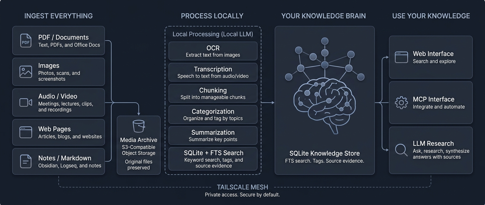

# dbrain



`dbrain` is a local-first second-brain scaffold for incremental imports from X
bookmarks, Apple Notes, GitHub stars, YouTube, Safari tabs and manually submitted web links,
with Markdown note rendering for Obsidian and local query over the imported
corpus.

## Install

Install the latest released `dbrain` CLI with Homebrew:

```sh
brew install darron/tap/dbrain
```

Or tap once and install by formula name:

```sh
brew tap darron/tap
brew install dbrain
```

Verify the installed binary:

```sh
dbrain version
```

## Requirements

Install the common local toolchain with Homebrew:

```sh
brew install go go-task/tap/go-task golangci-lint sqlite yt-dlp ffmpeg node deno ollama tesseract
brew install --cask google-chrome
```

Runtime tools and services:

- **Chrome or Chromium**: recommended for cookie-backed X and YouTube imports.
- **`summarize`**: required for source extraction and summary-backed answer synthesis. Verify with `summarize --help`.
- **`mw`**: MacWhisper CLI, required for `dbrain transcribe x-media` and the default X media step in `sync all`.
- **`ffprobe`**: required for X media transcription. It is installed by Homebrew's `ffmpeg` package.
- **`yt-dlp`**: required for `dbrain import youtube`.
- **`deno` or `node`**: recommended for YouTube challenge solving through `yt-dlp`.
- **`uv`**: recommended for `summarize` helper environments and transcriber setup flows.
- **`whisper-cli`**: optional fallback for YouTube audio transcription when captions are unavailable.
- **`~/.summarize/cache/whisper-cpp/models/ggml-base.bin`**: optional model file used by the `whisper-cli` fallback.
- **`ollama`**: optional local model runtime for source summaries, answer synthesis, OCR, and categorization.
- **`tesseract`**: optional local fallback for OCR.
- **`sqlite3`**: optional, but useful for inspecting `brain.db`.
- **`task`**: required for the top-level development tasks.
- **`golangci-lint`**: required for `task lint`.
- **`npm`**: required for `task web-install` and `task web-build`.
- **`caffeinate`**: optional macOS helper used automatically for long-running leaf commands when available.

Optional hosted services:

- **GitHub token**: `GITHUB_TOKEN` for `dbrain import github stars`.
- **OpenRouter**: `DBRAIN_OPENROUTER_API_KEY` or `OPENROUTER_API_KEY` for hosted categorization, OCR, and model calls.
- **S3-compatible storage / Cloudflare R2**: R2/S3 env or config values for media and SQLite archives.

Apple Notes import is local and direct-SQLite. On macOS it may require granting
Full Disk Access to the `dbrain` binary or, more reliably for local builds, to
the terminal or IDE app launching it. Rebuilding `bin/dbrain` may invalidate a
binary-specific permission grant.

For development in this checkout without touching installed state:

```sh
export DBRAIN_ROOT=.
task build
dbrain config paths
dbrain config env
```

## Command Index

- `dbrain archive media`
- `dbrain categorize batch`
- `dbrain categorize item`
- `dbrain categorize repair`
- `dbrain categorize source`
- `dbrain categorize sources`
- `dbrain config env`
- `dbrain config paths`
- `dbrain entity generate <query>`
- `dbrain entity index`
- `dbrain entity map [query]`
- `dbrain eval mcp`
- `dbrain extract links`
- `dbrain extract sources`
- `dbrain feed add <url>`
- `dbrain feed check [feed-key-or-url]`
- `dbrain feed list`
- `dbrain feed status <feed-key-or-url>`
- `dbrain get <source-key-or-id>`
- `dbrain hydrate x`
- `dbrain import apple-notes`
- `dbrain import github stars`
- `dbrain import safari-tabs`
- `dbrain import x-bookmarks`
- `dbrain import youtube`
- `dbrain link add <url>`
- `dbrain ocr x-photos`
- `dbrain repair fts`
- `dbrain repair notes`
- `dbrain repair sources`
- `dbrain research <question>`
- `dbrain search <query>`
- `dbrain serve mcp`
- `dbrain serve remote`
- `dbrain serve web`
- `dbrain sqlite archive`
- `dbrain sqlite restore`
- `dbrain stats activity`
- `dbrain stats backlog`
- `dbrain stats items`
- `dbrain stats pipeline`
- `dbrain stats sources`
- `dbrain sync all`
- `dbrain topic generate <topic>`
- `dbrain topic index`
- `dbrain topic map <topic>`
- `dbrain topic refresh [topic]`
- `dbrain transcribe x-media`
- `dbrain tsnet reset`
- `dbrain tsnet status`
- `dbrain version`
- `dbrain worker sources`

On macOS, `dbrain` will automatically use `caffeinate` when the command is
available, so long-running leaf commands keep the machine awake by default.
Use `--no-caffeinate` to disable that behavior for a specific run. You can
still pass `--caffeinate` to force it explicitly.

Structured debug logging is enabled by default. Use `--no-debug` when you want
quiet CLI output.

## Safety And Trust Model

`dbrain` is local-first, but it stores high-signal personal data. Treat
`brain.db`, rendered vault notes, media files, logs, temp files, chat
transcripts, and tsnet state as private local state. Keep `data/`, `vault/`,
`tmp/`, `cache/`, `logs/`, `.env`, `.envrc`, `.gocache/`, `.gomodcache/`,
`web/ui/node_modules/`, and `bin/` out of git and public release archives unless
you intentionally scrub and include them.

Imports are intended to be import-only against upstream services and apps. X,
GitHub, YouTube, Apple Notes, and Safari tab flows materialize local evidence;
Apple Notes and Safari tabs read from dbrain-owned SQLite snapshots. Normal
imports should not mutate upstream apps or delete local memories just because an
upstream bookmark, tab, note, star, or video later disappears.

`dbrain serve web` and `dbrain serve remote --web` are trusted read/write
administration surfaces. They can edit tags, queue links, save diagnostic chat
transcripts, trigger model-backed research/synthesis, and access archived media
helpers. `serve remote` relies on Tailscale/tsnet identity, ACLs, node tags, and
same-origin checks; there is no separate dbrain login or per-route authorization
layer. Do not expose the web UI through Tailscale Funnel or a public reverse
proxy. MCP surfaces are read-only, but they still expose local brain content to
connected clients.

Model-backed commands can send local evidence to the configured model provider.
Local Ollama calls stay on the configured Ollama endpoint. Hosted OpenRouter or
OpenAI-compatible calls may receive source extracts, note text, item text,
transcripts, OCR text, tags, and images depending on the command. Web, CLI, and
MCP research use model-assisted query planning by default when a planner or
summary model is configured; use `--no-planner`, `disable_planner=true`, or
retrieval-only modes when you want deterministic local retrieval without planner
model calls.

Archive features use S3-compatible storage only when configured. Media archives
and SQLite snapshots can contain personal content. A public media base URL makes
archived media links anonymously readable wherever that bucket policy allows;
without a public base URL, the web UI can still proxy or sign archive access for
trusted web users.

Local maintenance commands can delete, replace, or reset local dbrain state:
`dbrain archive media --prune-local` can remove local media files after archived
coverage is complete, `dbrain sqlite restore` replaces the active SQLite DB
after moving existing DB files aside, `dbrain tsnet reset` removes durable
Tailscale node state, `dbrain import apple-notes --forget-excluded` purges
indexed local content for notes that are now excluded, and `dbrain import
youtube` prunes deprecated `youtube_history` rows and orphaned legacy YouTube
sources as part of its import cleanup. `dbrain repair sources` clears selected
derived extraction/summary state so it can be rebuilt. Prefer `--dry-run` on
commands that offer it.

See [docs/architecture.md](docs/architecture.md) for the current package/state
architecture and [docs/web-route-capabilities.md](docs/web-route-capabilities.md)
for the web route capability matrix. See
[docs/schema-migrations.md](docs/schema-migrations.md) for SQLite migration,
backup, restore, and downgrade policy. See
[docs/maintenance-operations.md](docs/maintenance-operations.md) for local
delete, purge, prune, restore, and reset paths.

## Dev Tasks

- `task build`
- `task fmt`
- `task lint`
- `task test`
- `task test-mcp`
- `task web-build`
- `task web-install`

## Configuration And Layout

Installed/default layout:

- `~/.config/dbrain/config.yaml`: optional configuration file
- `~/.config/dbrain/categories.yaml`: tag rewrite/category vocabulary
- `~/.local/share/dbrain/brain.db`: local SQLite state
- `~/.local/share/dbrain/vault/items/...`: rendered Markdown notes for Obsidian
- `~/.local/share/dbrain/vault/sources/...`: rendered Markdown notes for linked sources
- `~/.local/share/dbrain/vault/entities/...`: derived entity notes and entity index
- `~/.local/share/dbrain/vault/topics/...`: generated topic/MOC notes
- `~/.local/share/dbrain/tmp`: temporary working files
- `~/.local/share/dbrain/cache`: cache files
- `~/.local/share/dbrain/logs`: log files

`dbrain` honors `XDG_CONFIG_HOME` and `XDG_DATA_HOME`; if set, the same
`dbrain` subdirectories are created under those bases.

To pin a command or service to one installed config file without inheriting a
checkout's `DBRAIN_ROOT`, pass `--config-file <path>` or set
`DBRAIN_CONFIG_FILE=<path>`. The config directory is the file's parent
directory; data, logs, cache, temp files, and the vault still default to the XDG
data layout unless separately configured by a feature-specific setting.

For local development or isolated runs, pass `--root <dir>` or set
`DBRAIN_ROOT=<dir>`. Explicit roots keep the original self-contained layout:

- `<dir>/config.yaml`
- `<dir>/categories.yaml`
- `<dir>/data/brain.db`
- `<dir>/vault/...`
- `<dir>/tmp`, `<dir>/cache`, and `<dir>/logs`

For repo-local development, this keeps commands pointed at the checkout:

```sh
export DBRAIN_ROOT=.
```

Resolution order for config layout is `--config-file`, `--root`,
`DBRAIN_CONFIG_FILE`, `DBRAIN_ROOT`, then XDG defaults.

Configuration currently resolves in this order: shell environment, `.envrc` or
`.env` in the config/root directory, then `config.yaml`. The YAML file can use
exact environment-style keys under `env`, or cleaner grouped keys:

```yaml
summary:
  model: ollama/qwen3.6:35b-a3b
  language: English

openrouter:
  api_key: op://Private/dbrain/OPENROUTER_API_KEY
  base_url: https://openrouter.ai/api/v1

ollama:
  base_url: http://127.0.0.1:11434

http:
  user_agent: ""

source:
  reader:
    base_url: https://r.jina.ai/
    domains: canada.ca,open.canada.ca,fintrac-canafe.canada.ca
  wayback:
    enabled: true
    availability_url: https://archive.org/wayback/available?url={escaped_url}

archive:
  provider: r2
  bucket: dbrain-media
  upload: true

env:
  GITHUB_TOKEN: keychain://dbrain/github-token
```

Secret-bearing fields can be direct values or typed references. Supported
references are `env:NAME`, `op://vault/item/field`, and
`keychain://service/account`. References are resolved by `dbrain` only when a
command needs that secret, so they do not need to be exported into your whole
shell session.

For macOS Keychain, store a secret with:

```sh
security add-generic-password -U -s dbrain -a openrouter-api-key -w "..."
```

Then reference it from `config.yaml`:

```yaml
openrouter:
  api_key: keychain://dbrain/openrouter-api-key
```

`config.yaml.sample` contains every currently supported grouped config value
with its matching environment variable comment on the same line:

```sh
cp config.yaml.sample ~/.config/dbrain/config.yaml
```

## Preflight Checks

`dbrain` runs lightweight preflight checks after resolving the active
configuration. The checks are meant to catch missing local vocabulary files and
missing secrets before a long import or enrichment run does partial work.

Missing `categories.yaml` is a warning, not a hard failure. Categorization can
still run, but it will not apply the canonical vocabulary rewrites and drops
from the category file. Homebrew/default installs should keep the file at:

```sh
~/.config/dbrain/categories.yaml
```

Development roots should keep it beside the root config:

```sh
<root>/categories.yaml
```

These selected features fail early when their required secrets are missing:

- GitHub imports require `GITHUB_TOKEN` or `github.token`.
- OpenRouter-backed categorization requires `DBRAIN_OPENROUTER_API_KEY`,
  `OPENROUTER_API_KEY`, or `openrouter.api_key`.
- OpenRouter-backed OCR requires the same OpenRouter key when the OCR model is
  an `openrouter/...` model.
- R2/S3 archive paths require an access key and secret when archive upload,
  bucket, endpoint, or public archive URL settings are configured.

Use `--config-file ~/.config/dbrain/config.yaml` for Homebrew/background
service runs when you want the installed binary to ignore checkout-local
environment overrides.

Every command help screen includes the effective configuration lookup summary.
Use this command for the authoritative env/config mapping:

```sh
dbrain config env
```

Use `dbrain config env --markdown` when you want a Markdown table for
docs or issue comments.

## Environment Variables

Lookup order is shell environment, `.envrc` or `.env` in the active config/root
directory, then `config.yaml`. `--root` wins over `DBRAIN_ROOT`.

Secret config values for GitHub, OpenRouter/OpenAI/Ollama API keys, and R2/S3
credentials may be direct values or typed references: `env:NAME`,
`op://vault/item/field`, or `keychain://service/account`.

| Environment variable(s) | config.yaml key | Default | Purpose |
| --- | --- | --- | --- |
| `DBRAIN_ROOT` | `(env only)` | `` | CLI root override. `--root` wins when both are set. |
| `XDG_CONFIG_HOME` | `(env only)` | `~/.config` | Base directory for default config files. |
| `XDG_DATA_HOME` | `(env only)` | `~/.local/share` | Base directory for default database, vault, cache, tmp, and logs. |
| `GITHUB_TOKEN` | `github.token` or `env.GITHUB_TOKEN` | `` | GitHub API token for importing stars. |
| `DBRAIN_SUMMARY_MODEL` / `SUMMARIZE_MODEL` | `summary.model` | `` | Default model for summarize-backed source and answer synthesis. |
| `DBRAIN_SUMMARY_LANGUAGE` / `DBRAIN_OUTPUT_LANGUAGE` / `SUMMARIZE_LANGUAGE` | `summary.language` | `en` | Output language for summaries; use `auto` to match source language. |
| `DBRAIN_CATEGORIZE_MODEL` | `categorize.model` | `openrouter/google/gemini-2.5-flash` | Default LLM model for item/source categorization. |
| `DBRAIN_OCR_MODEL` / `DBRAIN_X_PHOTO_OCR_MODEL` | `ocr.model` | `openrouter/google/gemini-3.1-flash-lite-preview` | Default model for X photo OCR. |
| `DBRAIN_OLLAMA_BASE_URL` / `OLLAMA_BASE_URL` / `OLLAMA_HOST` | `ollama.base_url` | `http://127.0.0.1:11434` | Ollama endpoint for local model calls. |
| `DBRAIN_OLLAMA_API_KEY` / `OLLAMA_API_KEY` | `ollama.api_key` | `ollama` | API key label used for Ollama-compatible local calls. |
| `OPENAI_BASE_URL` | `openai.base_url` or `env.OPENAI_BASE_URL` | `` | OpenAI-compatible base URL used by the summarize adapter when already exported. |
| `OPENAI_API_KEY` | `openai.api_key` or `env.OPENAI_API_KEY` | `` | OpenAI-compatible API key used by the summarize adapter when already exported. |
| `OPENAI_USE_CHAT_COMPLETIONS` | `openai.use_chat_completions` or `env.OPENAI_USE_CHAT_COMPLETIONS` | `` | Forces summarize/OpenAI-compatible calls onto chat completions when set. |
| `DBRAIN_USER_AGENT` | `http.user_agent` | `dbrain/<short-sha>` | User-Agent header for outbound API calls; source/web fetching keeps its own fetch headers. |
| `DBRAIN_OPENROUTER_BASE_URL` / `OPENROUTER_BASE_URL` | `openrouter.base_url` | `https://openrouter.ai/api/v1` | OpenRouter API endpoint. |
| `DBRAIN_OPENROUTER_API_KEY` / `OPENROUTER_API_KEY` | `openrouter.api_key` | `` | OpenRouter API key for hosted LLM/OCR/categorization calls. |
| `DBRAIN_OPENROUTER_REFERER` / `OPENROUTER_HTTP_REFERER` | `openrouter.referer` | `https://local.dbrain` | HTTP referer sent to OpenRouter for direct calls. |
| `DBRAIN_OPENROUTER_TITLE` / `OPENROUTER_X_TITLE` | `openrouter.title` | `dbrain` | HTTP title sent to OpenRouter for direct calls. |
| `DBRAIN_SOURCE_READER_DOMAINS` / `DBRAIN_HTTP_READER_DOMAINS` | `source.reader.domains` | `canada.ca` | Comma-separated domains routed through the reader/textifier path before summarize. |
| `DBRAIN_SOURCE_READER_BASE_URL` / `DBRAIN_HTTP_READER_BASE_URL` | `source.reader.base_url` | `https://r.jina.ai/` | Reader/textifier base URL for difficult domains. |
| `DBRAIN_SOURCE_WAYBACK_ENABLED` / `DBRAIN_WAYBACK_ENABLED` | `source.wayback.enabled` | `true` | Use Internet Archive Wayback as a final source extraction fallback before terminalizing repeated failures. |
| `DBRAIN_SOURCE_WAYBACK_AVAILABILITY_URL` / `DBRAIN_WAYBACK_AVAILABILITY_URL` | `source.wayback.availability_url` | `https://archive.org/wayback/available?url={escaped_url}` | Wayback Availability API URL template used for final source fallback. |
| `DBRAIN_APPLE_NOTES_ENABLED` | `apple_notes.enabled` | `false` | Include Apple Notes import in `sync all` when enabled; the standalone import command remains explicit. |
| `DBRAIN_APPLE_NOTES_DB_PATH` | `apple_notes.db_path` | `` | Optional Apple Notes `NoteStore.sqlite` path override. |
| `DBRAIN_APPLE_NOTES_EXCLUDE_FOLDERS` | `apple_notes.exclude_folders` | `` | Comma-separated or YAML-list Apple Notes folders/paths to skip. |
| `DBRAIN_APPLE_NOTES_EXCLUDE_ACCOUNTS` | `apple_notes.exclude_accounts` | `` | Comma-separated or YAML-list Apple Notes accounts to skip. |
| `DBRAIN_APPLE_NOTES_EXCLUDE_SHARED` | `apple_notes.exclude_shared` | `false` | Skip shared Apple Notes during import. |
| `DBRAIN_APPLE_NOTES_INDEX_ATTACHMENTS` | `apple_notes.index_attachments` | `true` | Extract supported Apple Notes attachment files by default. Set false or use `DBRAIN_APPLE_NOTES_SKIP_ATTACHMENTS=true` to keep metadata only. |
| `DBRAIN_APPLE_NOTES_SKIP_ATTACHMENTS` | `(env only)` | `false` | One-off opt-out for Apple Notes attachment file extraction/OCR while keeping note bodies and metadata. |
| `DBRAIN_APPLE_NOTES_ATTACHMENT_OCR` | `apple_notes.attachment_ocr` | `true` | Run local OCR for Apple Notes image attachments when `tesseract` is available. |
| `DBRAIN_APPLE_NOTES_SKIP_ATTACHMENT_OCR` | `(env only)` | `false` | One-off opt-out for Apple Notes image OCR while keeping non-OCR attachment extraction. |
| `DBRAIN_APPLE_NOTES_ATTACHMENT_MAX_BYTES` | `apple_notes.attachment_max_bytes` | `52428800` | Maximum attachment file size to extract. |
| `DBRAIN_APPLE_NOTES_TESSERACT_BINARY` | `apple_notes.tesseract_binary` | `tesseract` | Local Tesseract binary for Apple Notes image OCR. |
| `DBRAIN_SAFARI_TABS_ENABLED` | `safari_tabs.enabled` | `false` | Include Safari iCloud tabs import in `sync all` when enabled; the standalone import command remains explicit. |
| `DBRAIN_SAFARI_TABS_DB_PATH` | `safari_tabs.db_path` | `` | Optional Safari `CloudTabs.db` path override. |
| `DBRAIN_SAFARI_TABS_DEVICE` | `safari_tabs.device` | `` | Safari iCloud device name or UUID to import during `sync all`. |
| `DBRAIN_SAFARI_TABS_LIMIT` | `safari_tabs.limit` | `0` | Maximum Safari tabs to import after filtering; 0 means all matching tabs. |
| `DBRAIN_SAFARI_TABS_OLDER_THAN` | `safari_tabs.older_than` | `0` | Only import Safari tabs last viewed before this duration ago, for example `168h`. |
| `DBRAIN_SCHEDULER_SYNC_ALL_ENABLED` | `scheduler.sync_all.enabled` | `false` | Run `sync all` periodically from the long-running `serve remote` process. |
| `DBRAIN_SCHEDULER_SYNC_ALL_INTERVAL` | `scheduler.sync_all.interval` | `1h` | Interval between scheduled `sync all` runs when the scheduler is enabled. |
| `DBRAIN_SCHEDULER_SYNC_ALL_RUN_ON_START` | `scheduler.sync_all.run_on_start` | `false` | Run `sync all` once when `serve remote` starts, then continue on the interval. |
| `DBRAIN_SCHEDULER_SYNC_ALL_JITTER` | `scheduler.sync_all.jitter` | `0` | Optional bounded delay added to each interval so multiple nodes do not sync at exactly the same time. |
| `DBRAIN_SCHEDULER_SYNC_ALL_SOURCE_LIMIT` | `scheduler.sync_all.source_limit` | `0` | Optional scheduled source-worker limit; 0 uses the `sync all` default. |
| `DBRAIN_SCHEDULER_SYNC_ALL_SKIP_GITHUB` | `scheduler.sync_all.skip_github` | `false` | Skip GitHub import in scheduled `sync all` runs. |
| `DBRAIN_SCHEDULER_SYNC_ALL_SKIP_YOUTUBE` | `scheduler.sync_all.skip_youtube` | `false` | Skip YouTube import in scheduled `sync all` runs. |
| `DBRAIN_SCHEDULER_SYNC_ALL_SKIP_CATEGORIZE` | `scheduler.sync_all.skip_categorize` | `false` | Skip final categorization in scheduled `sync all` runs. |
| `DBRAIN_MEDIA_PROXY_BASE_URL` / `DBRAIN_WEB_BASE_URL` | `media.proxy.base_url` | `http://127.0.0.1:8742` | Base URL for local archived-media proxy links in rendered notes. |
| `DBRAIN_AUTO_ARCHIVE_MEDIA` / `DBRAIN_ARCHIVE_AUTO` | `archive.auto` | `false` | Run media archive automatically at the end of `sync all`. |
| `DBRAIN_ARCHIVE_UPLOAD` / `DBRAIN_R2_UPLOAD` | `archive.upload` | `false` | Upload eligible media before marking/pruning in `archive media`. |
| `DBRAIN_ARCHIVE_PROVIDER` / `DBRAIN_R2_PROVIDER` | `archive.provider` | `cloudflare_r2` | Archive provider label. |
| `DBRAIN_R2_BUCKET` / `DBRAIN_ARCHIVE_BUCKET` / `DBRAIN_S3_BUCKET` | `r2.bucket` or `archive.bucket` | `` | S3-compatible bucket for media and SQLite archives. |
| `DBRAIN_R2_PUBLIC_BASE_URL` / `DBRAIN_MEDIA_PUBLIC_BASE_URL` | `r2.public_base_url` or `media.public_base_url` | `` | Public base URL for archived media links. |
| `DBRAIN_R2_ENDPOINT` / `DBRAIN_S3_ENDPOINT` | `r2.endpoint` | `` | S3-compatible endpoint, such as a Cloudflare R2 account endpoint. |
| `DBRAIN_R2_REGION` / `DBRAIN_S3_REGION` / `AWS_REGION` / `AWS_DEFAULT_REGION` | `r2.region` | `auto` | S3-compatible region. |
| `DBRAIN_R2_ACCESS_KEY_ID` / `DBRAIN_S3_ACCESS_KEY_ID` / `AWS_ACCESS_KEY_ID` | `r2.access_key_id` | `` | S3-compatible access key ID. |
| `DBRAIN_R2_SECRET_ACCESS_KEY` / `DBRAIN_S3_SECRET_ACCESS_KEY` / `AWS_SECRET_ACCESS_KEY` | `r2.secret_access_key` | `` | S3-compatible secret access key. |
| `DBRAIN_R2_SESSION_TOKEN` / `DBRAIN_S3_SESSION_TOKEN` / `AWS_SESSION_TOKEN` | `r2.session_token` | `` | Optional S3-compatible session token. |

## Authentication

For GitHub stars, use a fine-grained PAT with:

- `User permissions`: `Starring: Read`
- `Repository permissions`: `Metadata: Read`
- `Repository permissions`: `Contents: Read`

`dbrain` reads `GITHUB_TOKEN` from the shell, `.envrc`, `.env`, or
`config.yaml`. Cookie-backed X and YouTube flows require a supported browser
profile with an active logged-in session; Chrome is the best-tested option.

## Optional Media Archive Env

To automatically offload finalized media to S3-compatible storage at the end of
`dbrain sync all`, export:

- `DBRAIN_AUTO_ARCHIVE_MEDIA=1`
- `DBRAIN_R2_BUCKET=<bucket>`
- `DBRAIN_R2_ENDPOINT=https://<account>.r2.cloudflarestorage.com`
- `DBRAIN_R2_ACCESS_KEY_ID=<key>`
- `DBRAIN_R2_SECRET_ACCESS_KEY=<secret>`

Optional:

- `DBRAIN_R2_REGION=auto`
- `DBRAIN_R2_SESSION_TOKEN=<token>`
- `DBRAIN_ARCHIVE_PROVIDER=cloudflare_r2`
- `DBRAIN_R2_PUBLIC_BASE_URL=https://...` when archived media should render as
  anonymously readable URLs in notes. Leave this unset for authenticated-only
  buckets.
- `DBRAIN_MEDIA_PROXY_BASE_URL=http://127.0.0.1:8742` when archived media
  should render as links or playable embeds backed by the local web proxy.
  This defaults to `http://127.0.0.1:8742` unless explicitly disabled with
  `DBRAIN_MEDIA_PROXY_BASE_URL=off`.

`sync all` only runs the archive stage automatically when
`DBRAIN_AUTO_ARCHIVE_MEDIA=1` or `--archive-media` is set. The archive stage
uploads eligible media after OCR/transcription reaches a terminal state, marks
the object as archived in the DB, and prunes the local file once every row
sharing that same `local_path` is safely archived.

The same S3-compatible credentials are used by `dbrain sqlite archive` and
`dbrain sqlite restore` for compressed database snapshots. SQLite archives are
stored under `archive/db/` by default; override with `--prefix` if needed.

## Optional Source Reader Env

Some sites are known to behave badly when handed directly to `summarize
--extract`, either because they hang, block automation, or need a textified
reader view. `dbrain` can route selected domains through a short Go fetch path
before summarization so those sources do not spend the full extraction timeout
in an external helper.

- `DBRAIN_SOURCE_READER_DOMAINS=canada.ca`
  Comma-separated domains that should bypass direct `summarize --extract`.
  Subdomains are included, so `canada.ca` also covers `open.canada.ca` and
  `fintrac-canafe.canada.ca`.
- `DBRAIN_SOURCE_READER_BASE_URL=https://r.jina.ai/`
  Reader/textifier base URL. The default is `https://r.jina.ai/`. A base URL
  may also include `{url}` or `{escaped_url}` placeholders for services that
  need a different URL shape.

For reader domains, `dbrain` first fetches the reader URL with text-oriented
headers. If the reader service rejects the request, it falls back to fetching
the original page directly with browser-style headers and extracting readable
HTML locally. Only the extracted raw text is then passed to `summarize` for the
derived summary.

When direct extraction reaches its terminal retry threshold, `dbrain` checks
the Internet Archive Wayback Availability API before marking the source
terminal. If a usable snapshot exists, the archived HTML is extracted and saved
with `extract_tool=wayback`; otherwise the source is marked `dead` or `gone`
according to the failure classification. Disable this final fallback with
`DBRAIN_SOURCE_WAYBACK_ENABLED=false`.

Wayback extracts are quality-gated before summarization. Very short archived
extracts and obvious archive/browser shells, such as `Loading...` or frame
fallback pages, keep their raw extract but get `summary_status=skipped` instead
of a model-generated summary. This avoids turning title-only or boilerplate
snapshots into plausible-looking knowledge.

Current source extraction terminal thresholds are: `gone` immediately for
404/410 responses; `dead` after 1 DNS NXDOMAIN or unsupported-file failure;
`dead` after 3 TLS, Cloudflare edge, connectivity, X article shell,
access-denied, or timeout failures; and `dead` after 5 generic fetch, HTTP 5xx,
or unclassified failures. Rows that are one failure away from a terminal state
bypass the normal 12-hour retry cooldown so Wayback recovery or terminal
classification happens on the next source enrichment pass.

To rebaseline old failed web-source rows after improving extraction logic,
reset only the failed web sources and let them enter the normal extraction
pipeline again:

```sh
dbrain repair sources --source-type web --extract-status error --extract-status dead --dry-run
dbrain repair sources --source-type web --extract-status error --extract-status dead --yes
dbrain extract sources --limit 500 --concurrency 4 --timeout 5m
```

This clears stale extract and summary state for currently failed web sources
without touching successful sources. Retryable failures start with fresh failure
counts; once they reach their terminal threshold, `dbrain` performs the Wayback
final-attempt check before marking the source `dead` or `gone`. `sync all` will
continue that retry progression naturally. For an urgent one-off row, use
`dbrain extract sources --source <source_key> --force` to bypass cooldown for
that specific source.

## Command Reference

Every command supports `--help`; the help screen includes usage, command flags,
global flags, and the environment/config lookup footer. The root help currently
looks like:

```text
Usage:
  dbrain [flags]
  dbrain [command]

Available Commands:
  archive     Manage archived media and other durable storage tiers
  categorize  Categorize items or linked sources with an LLM
  config      Show active configuration and storage paths
  entity      Derive and render entities from the local brain
  eval        Run local retrieval quality checks
  extract     Extract and summarize linked sources
  get         Load an item or source note
  hydrate     Hydrate canonical source data
  import      Import source data into the brain
  launchd     Install or print a macOS launchd service for dbrain
  link        Add and manage manually submitted links
  ocr         Extract text from downloaded images
  repair      Repair derived local artifacts
  research    Research the local brain with evidence and local synthesis
  search      Search items and sources
  serve       Serve local interfaces
  sqlite      Manage the local SQLite database
  stats       Show database counts and import progress
  sync        Run multi-stage refresh flows
  topic       Build and write topic maps from the local brain
  transcribe  Transcribe downloaded local media
  version     Print build and version information
  worker      Run long-lived background-style worker loops

Environment:
  --config-file wins over --root, DBRAIN_CONFIG_FILE, and DBRAIN_ROOT.
  Defaults: config in ~/.config/dbrain, state in ~/.local/share/dbrain.
  Runtime values resolve from shell env, then .envrc/.env, then config.yaml.
  Run "dbrain config env" for the full environment/config key table.
```

### `dbrain config paths`

Prints the active config, categories, data, database, vault, media, temp, cache,
and log paths. Use `--json` for automation.

```sh
dbrain config paths
```

### `dbrain config env`

Prints the supported environment variables and matching `config.yaml` keys. Use
`--json` for automation. This command is the authoritative source for the table
in this README.

```sh
dbrain config env
dbrain config env --markdown
```

### `dbrain import x-bookmarks`

Direct X bookmark import path. Requires a supported browser profile with valid
X cookies. Chrome/Chromium is the best-tested path.

```sh
dbrain import x-bookmarks --limit 25
```

### `dbrain import apple-notes`

Imports Apple Notes directly from the local Notes SQLite store through a
dbrain-owned snapshot. The importer is read-only against Apple's files,
materializes decoded notes as `apple_note` items, preserves raw decoded text,
renders Markdown notes, indexes discovered URLs, and summarizes notes by
default with the normal local summarization path. Use `--summarize=false` for a
materialization-only run. Attachment metadata and text already
exposed by Notes are indexed with the note; supported text/PDF attachment files
are extracted locally, and image attachments use local `tesseract` OCR when
available. Password-protected notes are skipped by default. Use account/folder
exclusions or `[[dbrain-ignore]]` inside a note for opt-out privacy.
Normal command output prints per-note progress only for notes that need work;
unchanged-current rows are counted in the final stats but not printed one by
one. In applied mode, `--limit` counts notes that need work, so repeated
limited runs skip unchanged-current notes and advance through the backlog.

```sh
dbrain import apple-notes probe
dbrain import apple-notes --dry-run --show-titles
dbrain import apple-notes --limit 25
dbrain import apple-notes
dbrain import apple-notes --force
dbrain import apple-notes --summarize=false
dbrain import apple-notes --exclude-folder Private
dbrain import apple-notes --exclude-folder Private --forget-excluded
dbrain import apple-notes --skip-attachment-ocr
```

### `dbrain import safari-tabs`

Imports Safari iCloud tabs from the local Safari `CloudTabs.db` through a
dbrain-owned snapshot. The importer is read-only against Safari's files,
targets one device by name or UUID, materializes matching HTTP(S) tabs as
`safari_tab` items, and leaves Safari untouched. Imported tab URLs then flow
through normal link discovery, source extraction, source summaries, rendering,
and categorization. Only tabs Safari has materialized into `CloudTabs.db` are
visible to dbrain; Private Browsing tabs, Start Page tabs, and not-yet-synced
iCloud changes may not appear. In practice, macOS may not refresh that local
database until Safari is running on the machine doing the import; launching
Safari can make newly synced tabs appear in a follow-up import within seconds.

```sh
dbrain import safari-tabs devices
dbrain import safari-tabs --device dfone --dry-run --show-titles
dbrain import safari-tabs --device dfone
dbrain import safari-tabs --device dfone --older-than 168h
dbrain import safari-tabs --device dfone --limit 100
```

### `dbrain sync all`

Runs the regular incremental refresh pipeline in one command: optional Apple
Notes import, optional Safari tabs import, direct X bookmark import, X
hydration, X media audio transcription, X photo OCR, link
discovery/enrichment, GitHub stars import, YouTube, RSS/Atom/JSON Feed
import, and an optional source-backlog worker batch. It then categorizes
uncategorized items and linked sources with the same categorizer used by
`dbrain categorize batch` and `dbrain categorize sources`, unless
`--skip-categorize` is passed. If enabled, the media archive stage runs after
categorization so image categorization can still use local photo files before
they are uploaded/pruned. Image
categorization is enabled for items by default; use `--categorize-images=false`
to disable it for text-only models. `--categorize-limit` is applied separately
to items and sources, so `--categorize-limit 25` can process up to 25 item rows
and 25 source rows.

X hydration uses `--x-limit`. X media transcription and X photo OCR can be
bounded independently with `--x-media-limit` and `--x-photo-ocr-limit`; either
limit falls back to `--x-limit` when left at 0. In the default configuration
this combines the requirements of X bookmark import, X hydration, X media
transcription, X photo OCR, link/source enrichment, YouTube import, and
categorization. A practical local setup usually includes a supported
Chrome/Chromium profile with valid cookies plus Ollama or an OpenRouter key,
`mw`, `ffprobe`, `summarize`, and `yt-dlp`. It supports `--skip-*` flags when
you only want part of the pipeline. Apple Notes is not run by default; enable it
with `--apple-notes` or
`DBRAIN_APPLE_NOTES_ENABLED=true`. Safari tabs are also disabled by default;
enable them with `--safari-tabs --safari-tabs-device <device>` or
`DBRAIN_SAFARI_TABS_ENABLED=true` plus `DBRAIN_SAFARI_TABS_DEVICE=<device>`.
Feeds are enabled in `sync all` by default. If no feeds are subscribed or due,
the feed stage reports that there is no feed work. Use `--skip-feeds` to skip
the stage or `--feed-limit` to cap checks in one run.

```sh
dbrain sync all --length short --timeout 5m
dbrain sync all --apple-notes --length short --timeout 5m
dbrain sync all --safari-tabs --safari-tabs-device dfone --length short --timeout 5m
dbrain sync all --skip-categorize --length short --timeout 5m
dbrain sync all --categorize-limit 25 --categorize-concurrency 2 --length short --timeout 5m
dbrain sync all --watch --poll-interval 1m --idle-exit-after 30m --length short --timeout 5m
```

### `dbrain feed`

Subscribes to RSS, Atom, and JSON Feed URLs and materializes linked entries as
normal `feed_entry` items. Each entry keeps raw feed metadata, links its
canonical article URL into the normal `sources` table when available, and is
updated only when its stable identity is unchanged but its content hash changes.
Entries disappearing from a feed are not deleted locally.

```sh
dbrain feed add https://example.com/feed.xml
dbrain feed add https://example.com/feed.xml --check
dbrain feed add http://localhost:8080/feed.atom --allow-private-network
dbrain feed list
dbrain feed status feed:abc123def456
dbrain feed check
dbrain feed check feed:abc123def456 --force
dbrain feed refresh feed:abc123def456 --force --summarize
dbrain feed disable feed:abc123def456
dbrain feed enable feed:abc123def456
```

`feed add` stores the subscription by default. Add `--check` when you want to
fetch and import current entries immediately.

`feed refresh FEED` is the manual feed QA path: it fetches one feed, processes
its entries, then extracts and summarizes the linked article sources from those
entries. Use `--force` when you want to reprocess an unchanged feed body and
rerun linked source enrichment.

When a feed entry has both its own content and a linked article URL, source
enrichment keeps both signals: the linked page is fetched as the primary source
text, and the feed entry text is included as explicit feed-entry context for
summary and search. If the feed entry has no useful body, the linked page stands
on its own.

Feed fetching blocks localhost, private, link-local, and multicast IPs by
default. For local feed development, pass `--allow-private-network` to
`feed add` / `feed check` / `feed refresh`, or set
`feeds.allow_private_network: true` in `config.yaml` /
`DBRAIN_FEEDS_ALLOW_PRIVATE_NETWORK=true`. The plural
`DBRAIN_FEEDS_ALLOW_PRIVATE_NETWORKS` is also accepted for compatibility.

`feed enable` clears previous feed health diagnostics and makes the feed
eligible for an immediate check. `feed disable` stops future checks without
removing already imported feed entries, items, sources, or rendered notes.

### `dbrain archive media`

Optional manual archive/prune pass for finalized media. It can either just
mark/prune already-uploaded media or upload directly to an S3-compatible bucket
first when `--upload` or archive-upload env vars are configured. `--prune-local`
deletes a local media file only after all rows sharing that `local_path` are
archived.

### `dbrain sqlite archive`

Creates a consistent SQLite snapshot with SQLite itself, compresses it as gzip,
and uploads it to the configured S3-compatible bucket under
`archive/db/brain-<timestamp>.db.gz`.

### `dbrain sqlite restore`

Finds the newest archived SQLite snapshot under `archive/db`, asks for
confirmation, moves any local `brain.db`, `brain.db-wal`, and `brain.db-shm`
files aside with a timestamped suffix, then installs the restored database.

### `dbrain serve web`

Serves the local read/write UI plus authenticated archived-media helpers. It can
update item/source tags, queue links, run model-backed research/synthesis, and
save non-indexed chat transcript diagnostics under `data/chat-transcripts/`.
When archive credentials are configured, `/media/asset/<media-asset-id>` streams
archived objects through the local server and `/api/media/signed-url?id=<id>`
returns a short-lived direct URL for one-off access. See
`docs/web-route-capabilities.md` for the current route capability map.
Bind this to localhost or another trusted interface unless you have reviewed
the route surface and trust boundary.

```sh
dbrain serve web
```

### `dbrain serve mcp`

Serves the local brain over MCP with read-only tools, resources, and prompts
for search, note access, research packs, topic maps, and pipeline status.
Stdio is the default local-agent transport. Stateless Streamable HTTP is
available as a parallel daemon transport for remote agents, usually behind
Tailscale Serve. MCP-only built-in tsnet serving is also available when you
want the binary to expose MCP directly on the tailnet.

```sh
dbrain serve mcp
dbrain serve mcp --transport http --addr 127.0.0.1:8743 --path /mcp
dbrain serve mcp --transport tsnet --tsnet-hostname dbrain
tailscale serve --bg 8743
```

Important flags:

- `--transport`: `stdio`, `http`, or `tsnet`; default `stdio`.
- `--addr`: HTTP listen address for `--transport http`; default
  `127.0.0.1:8743`.
- `--path`: Streamable HTTP MCP endpoint path for `http` or `tsnet`; default
  `/mcp`.
- `--allow-origin`: additional trusted HTTP `Origin`; repeatable. Empty
  `Origin` and same-host `Origin` requests are accepted by default.
- `--tsnet-*`: same state, auth, TLS, tag, and timeout settings as
  `dbrain serve remote`, used only with `--transport tsnet`.

### `dbrain serve remote`

Serves the existing read/write web UI and/or the read-only MCP endpoint on a
built-in Tailscale `tsnet` node. This is parallel to local stdio and localhost
HTTP transports; it does not require SSH access to the machine and does not
replace `dbrain serve web`.

The remote web UI is the same trusted read/write administration surface as
`serve web`. Tailscale ACLs and node policy govern who can reach it; dbrain does
not add a second login layer. Do not expose this surface publicly.

The default state directory is `<data_dir>/tsnet/<hostname>`, usually
`~/.local/share/dbrain/tsnet/dbrain`. Keep this directory out of iCloud,
Dropbox, and other sync folders. It holds durable Tailscale node state so
restarts do not repeatedly create new nodes or certificates.

```sh
dbrain serve remote --web --mcp
dbrain serve remote --web --mcp=false
dbrain serve remote --web=false --mcp
dbrain serve remote --tsnet-hostname dbrain-dev --tsnet-tls=false --tsnet-listen :80
```

MCP smoke test after startup:

```sh
curl -s https://dbrain.<tailnet>.ts.net/mcp \
  -H 'content-type: application/json' \
  -d '{"jsonrpc":"2.0","id":1,"method":"tools/list","params":{}}'
```

Important flags:

- `--web`: mount the full read/write web UI at `/`; default `true`.
- `--mcp`: mount read-only MCP Streamable HTTP at `/mcp`; default `true`.
- `--mcp-path`: MCP endpoint path; default `/mcp`.
- `--tsnet-hostname`: stable tailnet machine name; default `dbrain`.
- `--tsnet-state-dir`: durable tsnet state directory; default
  `<data_dir>/tsnet/<hostname>`.
- `--tsnet-tls`: use Tailscale HTTPS through `ListenTLS`; default `true`.
- `--tsnet-startup-timeout`: maximum time to wait for `tsnet.Up`; default
  `45s`.
- `--tsnet-auth-key-ref`: typed bootstrap secret ref, such as `env:NAME`,
  `op://Private/dbrain/tsnet-auth-key`, or `keychain://dbrain/tsnet-auth-key`.
- `--tsnet-allow-secret-command`: opt in to YAML-only
  `tsnet.auth_key_command` execution.
- `--tsnet-advertise-tags`: comma-separated Tailscale tags to request.
- `--tsnet-control-url`: experimental alternate Tailscale control server URL.

### `dbrain launchd`

Prints, installs, or removes a per-user macOS LaunchAgent for
`dbrain serve remote`. The generated service uses the same config resolution as
the command you run: default XDG paths unless you pass `--config-file` or
`--root`. If `DBRAIN_CONFIG_FILE` or `DBRAIN_ROOT` are present in the install
environment, the generated plist records the matching explicit flag so launchd
does not depend on your shell startup files.

Stable Homebrew service:

```sh
dbrain --config-file ~/.config/dbrain/config.yaml launchd plist \
  --bin /opt/homebrew/bin/dbrain

dbrain --config-file ~/.config/dbrain/config.yaml launchd install \
  --bin /opt/homebrew/bin/dbrain
```

Development service with a separate root, label, and configured
`tsnet.hostname` such as `dbrain-dev`:

```sh
go run ./cmd/dbrain --root /path/to/dbrain-checkout launchd plist \
  --label com.darron.dbrain-dev \
  --bin /path/to/dbrain-checkout/bin/dbrain

go run ./cmd/dbrain --root /path/to/dbrain-checkout launchd install \
  --label com.darron.dbrain-dev \
  --bin /path/to/dbrain-checkout/bin/dbrain
```

The plist is written to `~/Library/LaunchAgents/<label>.plist`, with stdout and
stderr logs under the active dbrain log directory. Use `--no-start` to write the
plist without loading it.

```sh
dbrain launchd restart
dbrain launchd restart --label com.darron.dbrain-dev

dbrain launchd uninstall
dbrain launchd uninstall --label com.darron.dbrain-dev
```

### Scheduled `sync all`

When `dbrain serve remote` is kept alive through launchd, it can also run
`sync all` on an internal interval. The scheduler uses the same resolved
config/root, opens the local database for each run, and skips a tick if a
previous scheduled sync is still active.

```yaml
scheduler:
  sync_all:
    enabled: true
    interval: 1h
    run_on_start: false
    jitter: 5m
    source_limit: 100
    source_concurrency: 2
    skip_github: false
    skip_youtube: false
    skip_categorize: false
```

The scheduled run uses the normal `sync all` preflight checks, so secret-backed
providers still need their configured `env:`, `op://`, or `keychain://`
references to resolve. Use the `skip_*` fields for stages you do not want the
background service to run.

Scheduler state is available from the running web surface:

```sh
curl -s https://dbrain.<tailnet>.ts.net/api/scheduler/sync-all
```

The response includes whether the scheduler is enabled, whether a run is active,
the next scheduled run time, and the last run's start, finish, status, and
error.

### `dbrain tsnet status`

Prints the resolved tsnet hostname, state directory, lock path, local state,
control URL, and active health using the same config/env/flag resolution as
`serve remote`. Status accepts the same target-shaping flags that affect
health output, including `--web`, `--mcp`, `--mcp-path`, `--tsnet-listen`,
`--tsnet-tls`, and `--tsnet-control-url`.

When a running `dbrain` process holds the state lock, status probes only the
configured web and MCP surfaces. Web probes expect `2xx`/`3xx`; MCP probes
accept `200` or `405` because browser-style `GET` may be rejected while
JSON-RPC `POST` is healthy. It reports `running`, `reachable`,
`web_reachable`, `mcp_reachable`, `cert_health`, `needs_login`, and
`control_url`. If MagicDNS lookup is unavailable to Go, status can use local
Tailscale peer status as a best-effort tailnet IP fallback while preserving TLS
certificate validation.

```sh
dbrain tsnet status
dbrain tsnet status --json
```

### `dbrain tsnet reset`

Removes the resolved tsnet state directory after confirmation. It refuses to
run if another `dbrain` process holds the state lock. Interactive reset prints
the resolved hostname and state directory and requires typing `reset`; use
`--yes` only for scripts.

```sh
dbrain tsnet reset
dbrain tsnet reset --yes
```

### `dbrain hydrate x`

Requires a supported browser profile with valid X cookies. Chrome/Chromium is
the best-tested path. On macOS you may see a Keychain prompt the first time
cookie decryption is used. Structured hydrate progress is logged by default;
use `--no-debug` to quiet operational debug output.

```sh
dbrain hydrate x --limit 50
```

### `dbrain transcribe x-media`

Requires `mw` and `ffprobe`. `mw` performs the transcription and `ffprobe`
checks whether a downloaded X video or animated GIF has an audio stream worth
transcribing. Normal runs skip already classified items; use `--force` when you
explicitly want to retry failures or reprocess existing transcript items.

```sh
dbrain transcribe x-media --limit 50
```

### `dbrain ocr x-photos`

Extracts text from downloaded X photos. Hosted OCR defaults to the configured
OpenRouter/Gemini model, with local fallback support where configured.

```sh
dbrain ocr x-photos --limit 50
```

For a read-only OCR bakeoff against the downloaded X photo corpus, use the
devtool. It defaults to the currently configured OCR model as the baseline and
compares it with `ollama/deepseek-ocr:3b`; it writes a Markdown report without
changing persisted OCR state.

```sh
go run ./cmd/devtools/ocr_model_compare --limit 30 --output /tmp/dbrain-ocr-compare.md
```

Useful variants:

```sh
go run ./cmd/devtools/ocr_model_compare --root . --limit 30 --download-missing --output /tmp/dbrain-ocr-compare.md
go run ./cmd/devtools/ocr_model_compare --limit 30 --json > /tmp/dbrain-ocr-compare.json
go run ./cmd/devtools/ocr_model_compare --limit 10 --models openrouter/google/gemini-3.1-flash-lite-preview,ollama/deepseek-ocr:3b,tesseract
```

### Model Bakeoffs

For read-only summary and categorization comparisons, use the model bakeoff
devtool. It runs the existing summary or categorization prompt against explicit
targets and models, reports timing and side-by-side outputs, and does not save
summaries, categories, or tags.

```sh
go run ./cmd/devtools/model_bakeoff \
  --mode source-summary \
  --lookup src:47acb64df52e \
  --model ollama/qwen3.6:27b \
  --model ollama/gemma4:31b \
  --output /tmp/dbrain-summary-bakeoff.md

go run ./cmd/devtools/model_bakeoff \
  --mode categorize-item \
  --lookup x:2052235121416188114 \
  --model ollama/qwen3.6:27b \
  --model openrouter/google/gemini-2.5-flash \
  --output /tmp/dbrain-categorize-bakeoff.md

go run ./cmd/devtools/model_bakeoff \
  --mode categorize-source \
  --lookup src:47acb64df52e \
  --model ollama/qwen3.6:27b \
  --model ollama/gemma4:31b \
  --json > /tmp/dbrain-categorize-source-bakeoff.json
```

### `dbrain import youtube`

Requires a browser profile with valid YouTube cookies, `yt-dlp`, and
`summarize`. When `--profile` is omitted, `dbrain` will try the bare browser
cookie source first and then retry discovered local Chromium-style profiles
such as `Default` and `Profile N`. A working local setup may also need `uv`.
For transcriptless videos, the best current setup is also `deno` or `node`,
plus `whisper-cli` and the `ggml-base.bin` model.

The importer pulls authenticated `Watch Later` and liked-video signals, stores
each feed entry as an item, stores the canonical video URL once as a source, and
keeps re-runs idempotent. YouTube source enrichment is transcript-first; when
captions are missing, `--transcriber auto` tries local audio transcription
before falling back to a skipped/no-content outcome.
At the start of each run it also removes deprecated `youtube_history` rows and
orphaned legacy YouTube sources from older importer versions; command output
reports those counts as `Items deleted` and `Sources deleted`.

```sh
dbrain import youtube --watch-later --liked --browser chrome --profile Default --limit 10 --transcriber auto
dbrain import youtube --watch-later --transcriber macwhisper
dbrain import youtube --watch-later --transcriber macwhisper:mlx:large-v3-turbo
summarize transcriber setup
```

### `dbrain import github stars`

Requires `GITHUB_TOKEN`. It uses the GitHub API directly, imports the star as
an append-only signal, stores the repo as a canonical `github` source, and
optionally creates and summarizes a linked homepage `web` source. The default
timeout is `2m` because local CLI-backed repo summaries can take longer than a
normal GitHub API round trip.

```sh
dbrain import github stars
```

### `dbrain extract links`

Requires `summarize`. It will prefer cached item `article_text` when
available, but still uses `summarize` for normalization and summarization. Use
`--concurrency` to run multiple source extract/summarize jobs in parallel after
discovery. The default concurrency is `4`, matching `sync all` and
`worker sources`; pass `--concurrency 1` for strictly sequential debugging.

```sh
dbrain extract links --discover-limit 100 --limit 25 --concurrency 4 --summarize=false
dbrain extract links --discover-limit 25 --limit 10 --concurrency 4 --length short
```

### `dbrain link add`

Adds one or more manually submitted URLs to the same source backlog used by
discovered links. By default it queues the source for the normal
`extract sources`, `worker sources`, or `sync all` flow; pass `--enrich` to
extract and summarize immediately.

```sh
dbrain link add "https://example.com/article"
dbrain link add "https://example.com/article" --enrich --length short
```

### `dbrain extract sources`

Requires `summarize`. This is the global source-backlog worker for already
known sources that still need extraction or summarization. Use `--concurrency`
to run multiple source extract/summarize jobs in parallel. The default is `4`;
pass `--concurrency 1` for strictly sequential debugging. Source freshness is
tracked with extract timestamps, summary timestamps, prompt versions, content
hashes, and summarize tool versions so refreshes can be policy-aware. Repeated
terminal extraction failures run a final Internet Archive Wayback fallback when
enabled; usable snapshots are saved as `extract_tool=wayback`, while short
archive shells are kept raw but skipped for summarization.

```sh
dbrain extract sources --limit 50 --concurrency 4 --length short
dbrain --no-caffeinate extract sources --limit 50 --length short --timeout 5m
```

### `dbrain worker sources`

Requires `summarize`. This is the long-running source-backlog worker: it
repeatedly runs `extract sources`-style batches until the queue is drained, and
can optionally keep polling for new source work with `--watch`. It supports
bounded parallelism via `--concurrency`. Use `--limit` to cap the total number
of sources processed in a single worker run, and `--batch-limit` to control
per-cycle batch size.

```sh
dbrain worker sources --limit 100 --concurrency 4
dbrain worker sources --watch --poll-interval 1m --idle-exit-after 30m --concurrency 4 --length short --timeout 5m
```

### `dbrain topic map`

No external tools required. Builds a topic graph from the local brain using
search plus the item/source link graph.

```sh
dbrain topic map "agent memory" --json
```

### `dbrain topic generate`

No external tools required. Writes a synthesized topic/MOC note under
`vault/topics/...` from the local brain, including sections like `Summary`,
`What This Topic Is`, `Main Angles`, entity pivots, open questions, and the
supporting note graph when that evidence exists.

```sh
dbrain topic generate "vector database"
```

### `dbrain topic refresh`

No external tools required. Rebuilds generated topic notes from their stored
frontmatter settings and refreshes the topic index.

```sh
dbrain topic refresh
dbrain topic refresh "vector database"
```

### `dbrain topic index`

No external tools required. Rebuilds the browsable topic index note from the
generated topic note set.

```sh
dbrain topic index
```

### `dbrain entity map`

No external tools required. Derives stable entities from local item/source
metadata and searches them by name, key, alias, or domain.

```sh
dbrain entity map "example"
dbrain entity map "example/project" --kind project --json
```

### `dbrain entity generate`

No external tools required. Writes matching entity notes under
`vault/entities/...` and refreshes the entity index.

```sh
dbrain entity generate "example/project" --kind project
```

### `dbrain entity index`

No external tools required. Re-derives all entities, writes their notes, and
rebuilds `vault/entities/index.md`.

```sh
dbrain entity index
```

### `dbrain stats items`

No external tools required. Reads item counts from `brain.db`.

```sh
dbrain stats items
dbrain stats items --source-type github_star --group-by none
```

### `dbrain stats sources`

No external tools required. Reads source counts from `brain.db`.

```sh
dbrain stats sources --source-type github --extract-tool github-api --group-by summary-status
```

### `dbrain stats activity`

No external tools required. Shows the latest item/source write timestamps plus
recent write counts inside a configurable time window.

```sh
dbrain stats activity
dbrain stats activity --window 30m
```

### `dbrain stats backlog`

No external tools required. Shows remaining queued work by pipeline stage and
whether the current queues are drained.

```sh
dbrain stats backlog
```

### `dbrain stats pipeline`

No external tools required. Shows policy-aware enrichment coverage across the
main pipeline stages.

### `dbrain eval mcp`

No external tools required. Runs read-only retrieval regression checks against
a JSON case file using the same retrieval path exposed through MCP research
tools. Use `--write-example <path>` to generate a starter case file and
`--json` for structured CI-friendly output.

```sh
dbrain eval mcp --write-example evals/local/mcp.json
dbrain eval mcp --file evals/local/mcp.json
```

### `dbrain version`

No external tools required. Prints build metadata including commit, build time,
git status, Go version, git version, build platform, and module info. Use
`--json` for structured output.

```sh
dbrain version
dbrain version --json
```

### `dbrain research`

Research is read-only and works directly from `brain.db`. It returns a research
pack with evidence, query/tag planning metadata, coverage notes, and optional
related evidence or topic brief data, then synthesizes a grounded local answer
by default. Web Research, Chat, CLI research, and MCP research packs use
model-assisted planning by default when a summary model is configured. The
harness asks the configured local model for a small bounded query plan with
aliases, alternate phrasings, and title-like variants, then validates and merges
it with deterministic fallback concepts before retrieval. Research packs expose
the planner metadata, query variants, and concept coverage signals so broad
natural-language questions can retry with stronger terms and prefer directly
matching evidence over broad near-misses. Use `--no-planner` or
`disable_planner=true` to force deterministic planning, and `--retrieval-only`
when you only want the evidence pack.
Synthesis requires `--model` or a configured `DBRAIN_SUMMARY_MODEL` /
`SUMMARIZE_MODEL`; it will not silently let the external summarizer choose a
hosted fallback.

```sh
dbrain research "What validates Kubernetes manifests?"
dbrain research "Show me GitHub repos about vector databases" --source-type github
dbrain research "What is Agent Memory?" --include-related --related-limit 2
dbrain research "What do I have in my brain about Mark Carney?" --retrieval-only --json
dbrain research "What do I know about local models?" --model ollama/qwen3.6:35b
dbrain research "Calgary father killed two kids" --retrieval-only
dbrain research "K8s Helm alternatives" --planner-model ollama/qwen3.6:35b --retrieval-only
dbrain research "K8s Helm alternatives" --no-planner --retrieval-only
```

### `dbrain search`

No external tools required. Searches items and sources from local SQLite/FTS,
including indexed user tags and derived item text.

```sh
dbrain search kubernetes
```

### `dbrain get`

No external tools required. Loads an item or source by source key or numeric
ID, with DB-first evidence sections used by MCP and CLI research flows.

```sh
dbrain get x:2045912259210485815
```

### `dbrain categorize item`

Sends a single item's full content bundle (post text, summary, transcript, OCR
text, article body, and images when enabled) to a local Ollama or OpenRouter
LLM and returns suggested categories and tags. Use `--apply` to save the result
directly to the item's `user_tags` field and re-index FTS. Image categorization
is enabled by default and embeds local or R2-stored photos as base64 for
vision-capable models; use `--images=false` to disable it. The model is
resolved from `--model`, `DBRAIN_CATEGORIZE_MODEL`, or the default
`openrouter/google/gemini-2.5-flash`.

```sh
dbrain categorize item --lookup x:1844700656625406274
dbrain categorize item --lookup x:1844700656625406274 --apply
dbrain categorize item --lookup x:1844700656625406274 --apply --images=false --model ollama/qwen2.5:7b-instruct
```

### `dbrain categorize batch`

Same as `dbrain categorize item` but processes multiple items in one pass. By
default only items with an empty `user_tags` field are selected; use `--force`
to re-categorize everything. `--limit` and `--concurrency` control throughput.
Use `--apply` to save results and `--json` for structured output. Saved
categorizer tags are merged with existing `user_tags` without duplicate
entries; existing tags are not overwritten. `dbrain sync all` runs this same
apply path for item rows at the end of the sync pipeline unless
`--skip-categorize` is passed.

```sh
dbrain categorize batch --limit 50 --concurrency 4 --model ollama/qwen2.5:7b-instruct --apply
dbrain categorize batch --force --limit 100 --concurrency 2 --model ollama/qwen2.5:7b-instruct --apply
dbrain categorize batch --limit 50 --json
```

### `dbrain categorize source`

Sends one linked source's metadata, summary, description, and extracted text to
the same categorizer. Use `--apply` to save the result to the source's own
`user_tags` field and re-index source search. Source tags are distinct from the
tags on saved items that backlink to the source.

```sh
dbrain categorize source --lookup src:db9d3b4551dd
dbrain categorize source --lookup https://www.example.com/ --apply
```

### `dbrain categorize sources`

Batch-categorizes linked sources. By default only sources with empty
`user_tags` are selected; use `--force` to re-categorize existing source tags.
This is useful when you want a source-centric view of linked articles,
repositories, papers, and videos rather than only the tags on the saved item
that referenced them. `dbrain sync all` runs this same apply path for source
rows at the end of the sync pipeline unless `--skip-categorize` is passed.

```sh
dbrain categorize sources --limit 50 --concurrency 2 --apply
dbrain categorize sources --force --limit 100 --json
```

### `dbrain categorize repair`

Repairs existing item and source `user_tags` using the configured category
rewrite vocabulary. This is useful after adding aliases or normalizing tag
forms.

```sh
dbrain categorize repair
```

### `dbrain repair notes`

No external tools required. Rebuilds rendered Markdown notes from `brain.db`,
which is useful if antivirus or sync tooling removed files from `vault/`.

```sh
dbrain repair notes
dbrain repair notes --missing-only=false --sources
```

### `dbrain repair sources`

No external tools required. Clears extraction and summary state for selected
sources so they can be reprocessed. Use `--domain <domain>` for a whole domain
or `--source <id>` for specific rows. Additional filters such as
`--source-type`, `--extract-status`, `--summary-status`, `--failure-kind`, and
`--min-failures` combine with AND semantics, which is useful for retrying a
known failed class without resetting unrelated rows. The command prints the
number of matched sources first and asks for confirmation unless `--dry-run` or
`--yes` is passed. For X article repair, add `--rehydrate-x-articles` to also
clear the linked X item hydration cache so the next `hydrate x` / `sync all`
run refetches article metadata instead of replaying stale previews.
This is a local derived-state reset, not an upstream deletion.

```sh
dbrain repair sources --domain canada.ca --dry-run
dbrain repair sources --domain canada.ca --yes
dbrain repair sources --source-type web --extract-status error --extract-status dead --dry-run
dbrain repair sources --source-type web --extract-status error --extract-status dead --yes
dbrain repair sources --source-type x_article --extract-status dead --summary-status error --failure-kind x_article_shell --min-failures 3 --dry-run
dbrain repair sources --source-type x_article --extract-status dead --summary-status error --failure-kind x_article_shell --min-failures 3 --rehydrate-x-articles --yes
```

### `dbrain repair fts`

No external tools required. Rebuilds the SQLite full-text search index from the
current item/source/enrichment rows.

```sh
dbrain repair fts
```

### `task web-install`

Requires `npm`. Installs the Svelte/Vite dependencies used to rebuild the web
UI source.

### `task web-build`

Requires `npm`. Rebuilds the embedded `web/ui/dist` assets from the Svelte
source tree. `task build` embeds the currently tracked `web/ui/dist` assets but
does not rebuild them, so run `task web-build` and commit the dist changes when
UI source or UI build configuration changes. See
[docs/release-build.md](docs/release-build.md) for the release checklist.

### `task fmt`

Requires `task` and `go`.

### `task lint`

Requires `task`, `go`, and `golangci-lint`.

### `task test`

Requires `task` and `go`.

## Operational Notes

### X hydration counters

- `Requested` means remote X fetches were actually attempted.
- `Hydrated` means items were processed and ended in an `ok_*` X hydration
  state.
- Those counters are intentionally different. A run can show a nonzero
  `Hydrated` count with `Requested: 0` if it is only reconciling already-stored
  local state.
- New top-level bookmarks can legitimately cause more hydrated items than the
  import count because quote children are stored and repaired as first-class
  `x_quote` items.

### Quoted X posts

- Quoted posts are stored as first-class `x_quote` items linked through
  `quoted_post`, not only as nested parent JSON.
- `dbrain sync all` performs bounded quote-only follow-up hydrate passes after
  the main X hydrate step so quote-of-quote tails can drain automatically
  without a separate manual `hydrate x` run.

### Link discovery counters

- `items_scanned` means X items with non-empty `links_json` that still need a
  discovery pass.
- `sources_queued` means new canonical source rows actually created after URL
  filtering and deduplication.
- Those counters are intentionally different. Many scanned items can still
  produce zero new sources.

## Model Backends

When no `--model` flag is provided, `dbrain` checks `DBRAIN_SUMMARY_MODEL` /
`SUMMARIZE_MODEL` or `summary.model` in `config.yaml`; otherwise the external
`summarize` tool chooses its own default. Pass `--model ollama/<name>` to test
a local GPU-backed model, or `--model openrouter/<provider>/<model>` for a
hosted catch-up run. `dbrain` sends direct Ollama summaries to the native
Ollama chat API with thinking disabled, and defaults to
`http://127.0.0.1:11434`. Override the target with
`DBRAIN_OLLAMA_BASE_URL`, `OLLAMA_BASE_URL`, or `OLLAMA_HOST` if the daemon is
elsewhere. The X photo OCR stage also honors `DBRAIN_OCR_MODEL` /
`DBRAIN_X_PHOTO_OCR_MODEL`; the current default is
`openrouter/google/gemini-3.1-flash-lite-preview`. If you already export
`OPENAI_BASE_URL` or `OPENAI_API_KEY`, `dbrain` leaves those alone. When
`--model` is set, it also takes precedence over `--cli`, so local-model runs do
not accidentally inherit the default CLI provider.

For a new machine or GPU-backed A/B run, start with small scoped commands
before pointing a whole sync at Ollama. A practical progression is:

```sh
dbrain research "What validates Kubernetes manifests?" --model ollama/qwen3.5:9b
dbrain extract sources --limit 10 --concurrency 2 --model ollama/qwen3.5:9b --timeout 10m
dbrain sync all --source-limit 25 --model ollama/qwen3.5:9b --timeout 10m
```

Good starting local models to compare on a stronger Mac are `qwen3.5:9b`,
`qwen2.5:7b-instruct`, and `gemma4:e4b`. Compare wall-clock time, summary
quality, and whether long GitHub/web extracts stay coherent before switching
the default workflow over.

## MCP

`dbrain serve mcp` exposes the local corpus over read-only MCP stdio for agent
research, browsing, topic maps, retrieval packs, and operational stats. The
server is DB-first by default, tag-aware, and includes OCR/transcript evidence
when those enrichments exist.

See [MCP.md](MCP.md) for the full agent workflow, tool contract, eval setup,
client configuration, importer contract, logging behavior, and skill setup.

## Skill

This repo includes Codex skills for agents:

- `skills/dbrain-mcp/SKILL.md` helps agents query the local dbrain corpus
  through MCP. See [MCP.md](MCP.md#skill) for installation notes and the
  recommended Codex MCP configuration.
- `skills/dbrain-model-bakeoff/SKILL.md` helps agents compare summary and
  categorization models with the read-only bakeoff devtool.

## License

`dbrain` is licensed under the MIT License. See [LICENSE](LICENSE).
Third-party dependency notices are in
[THIRD_PARTY_NOTICES.md](THIRD_PARTY_NOTICES.md).

## TODO

### MCP TODO

- [x] Add deterministic fixture coverage for MCP retrieval tests covering tags,
  OCR text, transcript text, linked sources, and source-type filters.
- [x] Add protocol-level tool-surface coverage so the core agent workflow tools
  (`dbrain_research_pack`, `dbrain_get`, `dbrain_get_many`, `dbrain_related`,
  maps, and search) stay advertised by `tools/list`.
- [x] Return structured, actionable MCP tool errors so clients and agents can
  recover from missing lookups, unsupported modes, or unknown tools.
- [x] Add a representative exact-tag evidence lane so broad entity questions
  expose saved tagged items even when linked source documents dominate ranking.
- [x] Add exact-tag evidence assertions to local MCP eval cases so users can
  catch regressions in the representative tagged-item lane.
- [x] Add a `task test-mcp` command so CI and open-source users can validate MCP
  retrieval behavior without a private corpus.
- [x] Keep model-backed summary tests deterministic when local summary-model
  environment variables are set.
- [x] Document the importer contract for new data sources: when importers
  populate the common item/source/text/tag/enrichment fields, MCP should
  discover them without source-specific code.
- [x] Add example local eval recipes for entity/tag, OCR, transcript, difficult
  domain, and broad-topic/noisy-result retrieval cases.
- [x] Show tags from saved-item backlinks when inspecting source nodes, so a
  selected `src:...` result exposes the user's tags from items that reference it.
- [x] Add stateless Streamable HTTP as a parallel MCP transport so remote agents
  can query the same read-only brain over a Tailscale-protected endpoint.
- [x] Add built-in `tsnet` serving for read-only MCP and the read/write web UI,
  including persistent state, lock protection, typed bootstrap secrets, and
  guarded state reset/status commands.

### Product TODO

- [ ] Continue improving topic/MOC synthesis quality and better periodic refresh workflows as the corpus fills out.
- [x] Add optional embedded `tsnet` serving for remote web and MCP access
  without requiring users to configure `tailscale serve` themselves.
- [x] Add source-level `user_tags`, source categorization commands, and
  source-tag search/MCP visibility separate from backlink item tags.
- [ ] Keep breaking the web UI into smaller Svelte components with a thin shared API client layer instead of letting the browser surface collapse into one large page component.
- [ ] Improve the web note reader further with richer Markdown rendering, better code-block presentation, and cleaner outbound link handling for vault notes.
- [x] Make external links in the web UI open in a new window/tab with safe defaults (`target="_blank"` plus `rel="noopener noreferrer"`), so note exploration does not constantly navigate away from the local brain surface.
- [x] Add URL-backed state and deeper note-to-note navigation in the web UI so searches, selected notes, and related pivots survive refreshes and remote sessions.
- [ ] Improve web UI tag visibility in search, graph, list, and detail views so selected items and linked sources show their own tags plus backlink tags without extra discovery.
- [ ] Expand the web operations/dashboard view with deeper worker drill-down and richer backlog trend views so repeated failures are easier to triage.
- [ ] Add first-class filters and browsing controls in the web UI for source type, kind, status, tag, and recency so the corpus is easier to slice than with one text box.
- [ ] Add semantic retrieval on top of SQLite/FTS, likely embeddings plus related-item expansion.
- [ ] Add a translation stage for non-English X content, storing both original and translated text.
- [ ] Broaden media ingestion beyond the current X image/video downloads, with content-hash deduplication across repeated saves and reposted duplicates.
- [ ] Add Apple Podcasts as a first-class imported signal/source type so podcast episodes can enter the same item/extract/summary pipeline as YouTube and web sources.

### Pipeline TODO

- [ ] Tighten X link-discovery candidate selection so items whose only links are X self-links like `/photo/1` or `/video/1` do not get rescanned and inflate `items_scanned` without producing real source candidates.
- [x] Harden the YouTube pipeline for transcript-missing videos and improve the fallback/transcription path.
- [ ] Audit X media transcription throughput by recording per-video duration/bytes/transcript chars and testing cautious MacWhisper parallelism; avoid raising default concurrency until local GPU/CPU contention is understood.
- [x] Add an OCR bakeoff/audit command that can run the same image set through multiple OCR backends, report side-by-side output quality and timings, and avoid changing persisted item OCR state.
- [x] Add a summary/categorization bakeoff devtool that can run the same source extract or content bundle through multiple models/backends, report side-by-side outputs and timings, and avoid changing persisted summary/tag state.
- [x] Improve provider provenance so stored summaries always record the exact backend/model used.
- [x] Make backlog/admin summary freshness stats policy-aware instead of exact-model-aware, so switching between acceptable local/hosted summary models does not make the whole corpus look stale.
- [ ] Add explicit source-of-truth audit commands such as `dbrain audit github-stars`, `dbrain audit youtube-watch-later`, `dbrain audit x-bookmarks`, and `dbrain audit all --json`, while treating the local DB as append-only by default.
- [ ] Add a pre-summary staging path for oversized extracts so giant PDFs and long documents can be chunked, pre-compressed, or locally preprocessed before hosted summary calls hit provider context limits.
- [ ] Add an oversized-X-video policy for media download/transcription with byte-size and/or duration gating, lower-bitrate transcription variants, and terminal `too_large` / `too_long` states instead of endless retry.
- [ ] Maybe reclassify non-actionable X media transcript outcomes like `no_audio`, `noise`, and `too_short` out of the generic failed bucket so transcription stats distinguish real pipeline errors from terminal no-content cases.
- [ ] Add an optional X thread expansion path when a bookmarked post is clearly part of a longer thread.
- [x] Add a config-driven scheduler inside `serve remote` so launchd-backed installs can run `sync all` periodically and skip overlapping runs.
- [x] No longer needed for now: keep `Obscura` (`https://github.com/h4ckf0r0day/obscura`) only as an external reference if source extraction gets stuck again. The current protected-fetch and Wayback fallback path covers the original gap well enough.
